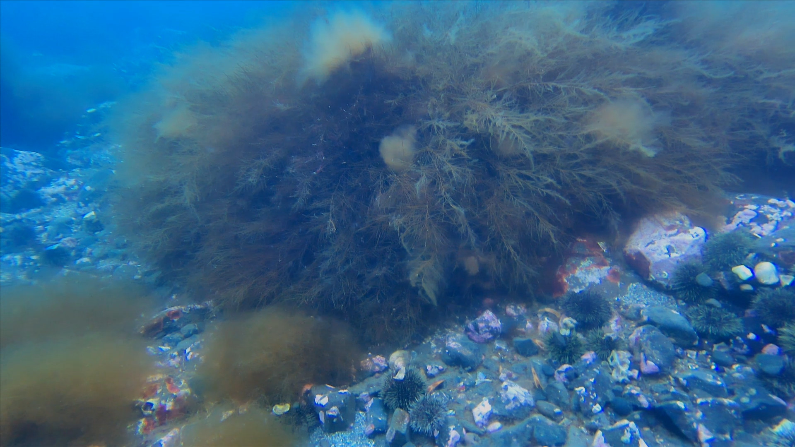
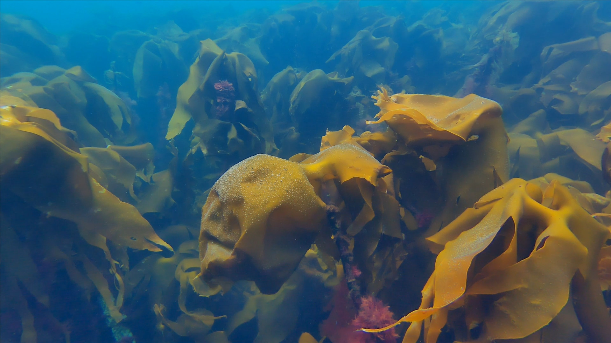

# Forkönnun við Finnsstaðanes 2018
*Rannsóknarfólk: undirritaður Karin Zech, Guðmundur Björnsson fyrrverandi grásleppuveiðimaður og Bjarni Ottósson frá björgunarsveitinni.*

Ákveðið var að hefja forkönnun á hluta svæðisins á sjókajak dagana 2. og 15. ágúst 2017. Í fyrri ferðinni var farið á tveimur kajökum frá Skagaströnd til Eyjareyjar (um 6 km leið) en í seinni ferðinni var farið var frá Kálfshamarsvík til Skagastrandar (um 20 km leið) og skiptust þá tveir ræðarar á ([sjá Viðauka 1](#v1)). Nokkur svæði voru valin til frekari skoðunar með neðansjávarmyndavél, fjarstýrðum kafbáti (\@ref(fig:trident)). 

Þann 21. Júní 2018 var farið í fyrstu myndatökurnar en það vildi svo óheppilega til að kafbáturinn bilaði í þeirri ferð. Nýtt tæki var fengið rúmum mánuði seinna 8. ágúst ([sjá Viðauka 2](#v2)).

Þann 6. september 2018 var svæðið úti fyrir Finnstaðanesi kannað með kafbátnum. Farið var á báti björgunarsveitarinnar Strandar við fjórða mann. Myndskeið voru tekin upp frá 3 til 21 metra dýpis. Ferðin tók um eina og hálfa klukkustund en þá var undirritaður orðinn sjóveikur af því að stara á skjáinn og einnig var bilun í báðum mótorum bátsins. Myndefnið var greint af rannsóknarfólki BioPol til að bera kennsl á helstu tegundir í þaraskóginum.

```{r setup-options}
 knitr::opts_chunk$set(	echo = FALSE,	fig.align = "center",	message = FALSE,	warning = FALSE,	out.width='100%',	error=FALSE)
```

```{r trident, fig.cap='Tækið sem fékkst fyrir styrkféð frá SSNV kallast [Trident](https://www.openrov.com/) og er framleitt af OpenRov. Hér sést Karin Zech starfsmaður BioPol rýna á skjáinn á fjarstýringunni að tækinu og Guðmundur Björnsson fyrrv. grásleppuveiðimaður var okkur til halds og trausts. ', out.width='35%', fig.show = 'hold'}

knitr::include_graphics(c("myndir/Trident_litil.jpg","myndir/karin.jpg"))
```


# Forkönnun við Eyrina 2019 (kajak)
*Rannsóknarfólk: undirritaður*

Þann 11. júní 2019 fór undirritaður á kajak frá Hrafná innan við Skagaströnd til að kanna mörk þaraskógarins á milli Eyrarinnar og Skeljatanga (sjá kort). Daginn eftir var farið út á sama svæði, á kajak, með drónann til að athuga tegundasamsetningu þarans og vöxt. Kajakinn var bundinn við netabauju til að reka ekki og myndir teknar með drónanum í kringum baujuna. **Setja inn myndir og hlekk á vídjó**


```{r mapviewskA, fig.cap='Siglt var á kajak upp að bauju við grásleppunet (sem notuð var sem ankeri) á milli Eyrarinnar og Skeljatanga rétt innan við Skagaströnd. Tekin voru myndskeið til að greina tegundir þara og meta vöxt hans.'}

library(XML)
library(OpenStreetMap)
library(lubridate)
library(raster)
library(sp)
shift.vec <- function (vec, shift) {
  if(length(vec) <= abs(shift)) {
    rep(NA ,length(vec))
  }else{
    if (shift >= 0) {
      c(rep(NA, shift), vec[1:(length(vec)-shift)]) }
    else {
      c(vec[(abs(shift)+1):length(vec)], rep(NA, abs(shift))) } } }

col1 <- seq(0,100,5)
col2 <- seq(200, 100, -5)
my_df <- data.frame(c1= col1, c2= col2)
my_df$nc1 <- shift.vec(my_df$c1, -1)
my_df$nc2 <- shift.vec(my_df$c2, -1)

options(digits=10)
# Parse the GPX file
pfile <- htmlTreeParse(file = "skjol/Current.gpx", error = function(...) {
}, useInternalNodes = T)

elevations <- as.numeric(xpathSApply(pfile, path = "//trkpt/ele", xmlValue))
times <- xpathSApply(pfile, path = "//trkpt/time", xmlValue)
coords <- xpathSApply(pfile, path = "//trkpt", xmlAttrs)

#str(coords)

lats <- as.numeric(coords["lat",])
lons <- as.numeric(coords["lon",])

geodf <- data.frame(lat = lats, lon = lons, ele = elevations, time = times)
rm(list=c("elevations", "lats", "lons", "pfile", "times", "coords"))
#geodf <- geodf[isoyear(geodf$time)>2018,]
geodf <- geodf[680:1153,]
#head(geodf)


geodf$lat.p1 <- shift.vec(geodf$lat, -1)
geodf$lon.p1 <- shift.vec(geodf$lon, -1)
#head(geodf)

geodf$dist.to.prev <- apply(geodf, 1, FUN = function (row) {
  pointDistance(c(as.numeric(row["lat.p1"]),
                  as.numeric(row["lon.p1"])),
                c(as.numeric(row["lat"]), as.numeric(row["lon"])),
                lonlat = T)
})

#head(geodf$dist.to.prev)

td <- sum(geodf$dist.to.prev, na.rm=TRUE)
#print(paste("Róið var", td, "metra"))

geodf$time <- strptime(geodf$time, format = "%Y-%m-%dT%H:%M:%OS")
# Shift the time vector, too.
geodf$time.p1 <- shift.vec(geodf$time, -1)
# Calculate the number of seconds between two positions.
geodf$time.diff.to.prev <- as.numeric(difftime(geodf$time.p1, geodf$time))

#head(geodf$time.diff.to.prev, n=15) 

geodf$speed.m.per.sec <- geodf$dist.to.prev / geodf$time.diff.to.prev
geodf$speed.km.per.h <- geodf$speed.m.per.sec * 3.6
geodf$speed.km.per.h <- ifelse(is.na(geodf$speed.km.per.h), 0, geodf$speed.km.per.h)
geodf$lowess.speed <- lowess(geodf$speed.km.per.h, f = 0.2)$y
geodf$lowess.ele <- lowess(geodf$ele, f = 0.2)$y

# plot(geodf$speed.km.per.h, type = "l", bty = "n", xaxt = "n", ylab = "Hraði (km/h)", xlab = "",
#      col = "grey40")
# lines(geodf$lowess.speed, col = "blue", lwd = 3)
# legend(x="topright", legend = c("GPS hraði", "LOWESS hraði"),
#        col = c("grey40", "blue"), lwd = c(1,3), bty = "n")
# abline(h = mean(geodf$speed.km.per.h), lty = 2, col = "blue")
# 
# plot(rev(geodf$lon), rev(geodf$lat), type = "l", col = "red", lwd = 3, bty = "n", ylab = "Latitude", xlab = "Longitude")

library(mapview)
#class(geodf)

kajak <- geodf
coordinates(kajak) <- ~ lon + lat
proj4string(kajak) <- "+init=epsg:4326"
#class(spdf_geo)
sk1 <- rgdal::readOGR(dsn="skjol/skogar/sk1/sk1.shp",verbose = FALSE)
mapview(kajak,color="red",col.regions="grey",map.types="Esri.WorldImagery")+mapview(sk1,color="red",col.regions="grey")

#mapview(spdf_geo,map.types="Esri.WorldImagery")


```


# Stekkjavík og Sölvabakki 2019
*Rannsóknarfólk: undirritaður* Hlekkur á möppu með [myndskeiðum](https://www.dropbox.com/sh/pcobg1zexnhsm9r/AABOmyp9I87GbuT6qs3SRxWDa?dl=0)

Farið var á Zodiac inn að Sölvabakka föstudaginn 21. júní. Báturinn er í eigu björgunarsveitrinnar Stráka á Skagaströnd, Einn maður um borð og var Trident kafbáturinn meðferðis. Kafbáturinn var settur niður á þremur stöðum á milli Stekkjavíkur og Sölvabakka.  Botninn er annars vegar sendinn með grjóti hér og þar eða hins vegar klapparbotn. *Laminaria sp.* mynda þarabreiður nær samfellt milli stöðva 1 og 3. en talsvert afrán er á þara vegna ígulkerja svo að klappir geta verið berar.

[Stöð 1](https://www.dropbox.com/s/6eh4ntihn256yt7/Trident-Jun-21-115230-HQ.mp4?dl=0),
[Stöð 2](https://www.dropbox.com/s/y25irxzi70btw6s/Trident-Jun-21-122032-HQ.mp4?dl=0),
[Stöð](https://www.dropbox.com/s/u30ejcqt9aw63d2/Trident-Jun-21-133207-HQ.mp4?dl=0).


```{r mapviewskB,echo = FALSE,	fig.align = "center",	message = FALSE,	warning = FALSE,	out.width='100%',	error=FALSE}


library(mapview)
Dypi<- rgdal::readOGR(dsn="skjol/skogar/sk2/klipp.shp", verbose = FALSE)
stodvar<- sf::read_sf(dsn="skjol/skogar/sk2/stodvar")
leid<- sf::read_sf(dsn="skjol/skogar/sk2/Current.GPX",layer="tracks")
library(RColorBrewer)
pal <- colorRampPalette(brewer.pal(length(unique(Dypi@data$MinZ)), "Blues"))
map <- mapview(Dypi,map.types="Esri.WorldImagery",zcol="MinZ",color = pal) + mapview(leid) + mapview(stodvar,type="l")
library(magrittr)
img <- "https://github.com/harkanatta/ssnv_trident/blob/master/graphs/tvologo.jpg?raw=true"
map %>% leafem::addLogo(img, width = 265/2, height = 200/2,offset.y = 20,offset.x = 80,alpha = 0.7) %>% leaflet.extras::addFullscreenControl(pseudoFullscreen = T)


```

## Stöð 1

```{r mynd-sk-tvo-stod-eitt,echo = FALSE,	fig.align = "center",	message = FALSE,	warning = FALSE,	out.width='100%',	error=FALSE, fig.cap='Talsvert af „þangskeggi“ eða sambýli af sepum hveldýra (*Hydrozoa*) en einnig sést í öðuskel (*Modiola modiolus*) '}



```

```{r mynd-sk-tvo-stod-eittB,echo = FALSE,	fig.align = "center",	message = FALSE,	warning = FALSE,	out.width='100%',	error=FALSE, fig.cap='Stöð eitt á korti við Stekkjavík og Sölvabakka. *Laminaria* tegundir mynda þarabreiður (*L. digitata* eða *L. borealis*). '}

knitr::include_graphics("skjol/skogar/sk2/stodvar/st1/sk2-st1B.jpg")

```

```{r mynd-sk-tvo-stod-tvo,echo = FALSE,	fig.align = "center",	message = FALSE,	warning = FALSE,	out.width='100%',	error=FALSE, fig.cap='Myndir frá stöð eitt á korti við Stekkjavík og Sölvabakka. Botninn er sendinn með grjóti hér og þar. Sandmaðkshraukar (*Arenicola marina*) og kúfskeljar (*Arctica islandica*) í miklu magni.'}

knitr::include_graphics("skjol/skogar/sk2/stodvar/st2/sk2-st2.jpeg")

```


```{r mynd-sk-tvo-stod-tvoB,echo = FALSE,	fig.align = "center",	message = FALSE,	warning = FALSE,	out.width='100%',	error=FALSE, fig.cap='Myndir frá stöð eitt á korti við Stekkjavík og Sölvabakka. Botninn er sendinn með grjóti og klöppum hér og þar. Skeljabrot og leifar af kísilþörungum (*Lithothamnion*) sem ígulker hafa líklega skrapað upp.'}

knitr::include_graphics("skjol/skogar/sk2/stodvar/st2/sk2-st2B.jpeg")

```


# Hamarsbúð og Sauðá 2019
*Rannsóknarfólk: undirritaður og Einar Þorleifsson starfsmaður Náttúrustofu Norðurlands vestra.* [Hlekkur á möppu með myndskeiðum](https://www.dropbox.com/sh/rodn0wueqkjfz1i/AAALWpzgA0WOKZcknNURKd1Ia?dl=0)

[Stöð 1](https://www.dropbox.com/s/esjsqxal7ehehof/Trident-Jul-11-125153-HQ.mp4?dl=0),
[Stöð 2](https://www.dropbox.com/s/ytjy4sl1n0ozmjb/Trident-Jul-11-131216-HQ.mp4?dl=0),
[Stöð 3](https://www.dropbox.com/s/5qn3lgbcrxlnc7y/Trident-Jul-11-135213-HQ.mp4?dl=0).

Báturinn var sjósettur í fjöru við Hamarsbúð á vestanverðu Vatnsnesi norðan við Hvammstanga. Siglt var í 3-4 kílómetra norður að fyrirætluðum sýnatökustað og virtist vera nokkuð samfelld þarabreiða alla leiðina. 


```{r mapviewskC}

library(mapview)
Dypi<- rgdal::readOGR(dsn="skjol/skogar/sk3/klipp.shp", verbose = FALSE)
stodvar<- sf::read_sf(dsn="skjol/skogar/sk3/punktar.shp")
leid<- sf::read_sf(dsn="skjol/skogar/sk3/Current.GPX",layer="tracks")
library(RColorBrewer)
pal <- colorRampPalette(brewer.pal(length(unique(Dypi@data$MinZ)), "Blues"))
map <- mapview(Dypi,map.types="Esri.WorldImagery",zcol="MinZ",color = pal) + mapview(leid) + mapview(stodvar,type="l")
library(magrittr)
img <- "https://github.com/harkanatta/ssnv_trident/blob/master/graphs/tvologo.jpg?raw=true"
map %>% leafem::addLogo(img, width = 265/2, height = 200/2,offset.y = 20,offset.x = 80,alpha = 0.7) %>% leaflet.extras::addFullscreenControl(pseudoFullscreen = T)
```


```{r mynd-sk-thrju-stod-tvo,echo = FALSE,	fig.align = "center",	message = FALSE,	warning = FALSE,	out.width='100%',	error=FALSE, fig.cap='*Stöð 2*. Hrossaþari eða stórþari (*Laminaria digitata* eða *Laminaria hyperborea*)'}



```

Marinkjarni (Alaria esculenta) 
```{r mynd-sk-thrju-stod-tvoB,echo = FALSE,	fig.align = "center",	message = FALSE,	warning = FALSE,	out.width='100%',	error=FALSE, fig.cap='*Stöð 2*. Hrossaþari eða stórþari (*Laminaria digitata* eða *Laminaria hyperborea*)'}

knitr::include_graphics("skjol/skogar/sk3/stodvar/st2/sk3-st2B.jpg")

```

 
```{r mynd-sk-thrju-stod-tvoC,echo = FALSE,	fig.align = "center",	message = FALSE,	warning = FALSE,	out.width='100%',	error=FALSE, fig.cap='*Stöð 2*. Hrossaþari eða stórþari (*Laminaria digitata* eða *Laminaria hyperborea*) og marinkjarni (*Alaria esculenta*)'}

knitr::include_graphics("skjol/skogar/sk3/stodvar/st2/sk3-st2C.jpg")

```

# Hofsgrunn 2019
*Rannsóknarfólk: undirritaður og Arnar Viggósson náttúruunnandi.*
[Hlekkur á möppu með myndskeiðum](https://www.dropbox.com/sh/5e86jwymrmedy8i/AAC7B73fHdewmccaKuRMGQEHa?dl=0)


Zodiak-bátur björgunarsveitar Skagastrandar var sjósettur í Kálfshamarsvík (sjá kort) og siglt var út í punkt á miðju Hofsgrunninu. Þar var Trident-kafbáturinn settur niður fimm sinnum.

[Stöð 1](https://www.dropbox.com/s/mykfrmg4j4nzcam/Trident-Jul-15-124522-HQ.mp4?dl=0),
[Stöð 1B](https://www.dropbox.com/s/hrgywt28fjk64mg/Trident-Jul-15-130236-HQ.mp4?dl=0),
[Stöð 2](https://www.dropbox.com/s/gdrtgzs2q3nn6w0/Trident-Jul-15-131557-HQ.mp4?dl=0),
[Stöð 3](https://www.dropbox.com/s/vv1bobcfzhwtl06/Trident-Jul-15-132942-HQ.mp4?dl=0),
[Stöð 4](https://www.dropbox.com/s/oyqqueli4qow0mo/Trident-Jul-15-134800-HQ.mp4?dl=0),
[Stöð 5](https://www.dropbox.com/s/d1dp5a0bftm3z5n/Trident-Jul-15-140418-HQ.mp4?dl=0).

```{r mapviewskD}

library(mapview)
Dypi<- rgdal::readOGR(dsn="skjol/skogar/sk4/klipp.shp", verbose = FALSE)
stodvar<- sf::read_sf(dsn="skjol/skogar/sk4/stodvar.shp")
#leid<- sf::read_sf(dsn="skjol/skogar/sk4/Current.GPX",layer="track_points")
leid<- sf::read_sf(dsn="skjol/skogar/sk4/Current.GPX",layer="tracks")
library(RColorBrewer)
pal <- colorRampPalette(brewer.pal(length(unique(Dypi@data$MinZ)), "Blues"))
map <- mapview(Dypi,map.types="Esri.WorldImagery",zcol="MinZ",color = pal) + mapview(leid) + mapview(stodvar)
library(magrittr)
img <- "https://github.com/harkanatta/ssnv_trident/blob/master/graphs/tvologo.jpg?raw=true"
map %>% leafem::addLogo(img, width = 265/2, height = 200/2,offset.y = 20,offset.x = 80,alpha = 0.7) %>% leaflet.extras::addFullscreenControl(pseudoFullscreen = T)

```

# Hindisvík 2019

```{r mapviewskE,echo = FALSE,	fig.align = "center",	message = FALSE,	warning = FALSE,	out.width='100%',	error=FALSE}


library(mapview)
#Dypi<- rgdal::readOGR(dsn="skjol/skogar/sk2/klipp.shp", verbose = FALSE)
#stodvar<- sf::read_sf(dsn="skjol/skogar/sk2/stodvar")
leid<- sf::read_sf(dsn="skjol/skogar/sk5/Current.GPX",layer="track_points")
leidin <- leid[leid$time<"2019-08-21 15:42:55",]
mapview(leidin)


```