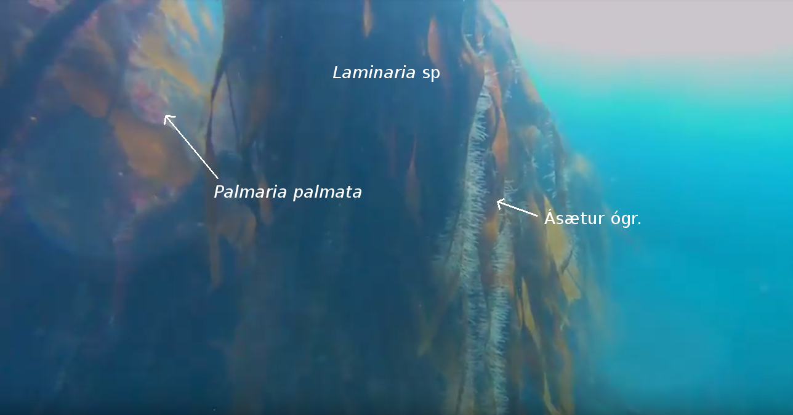
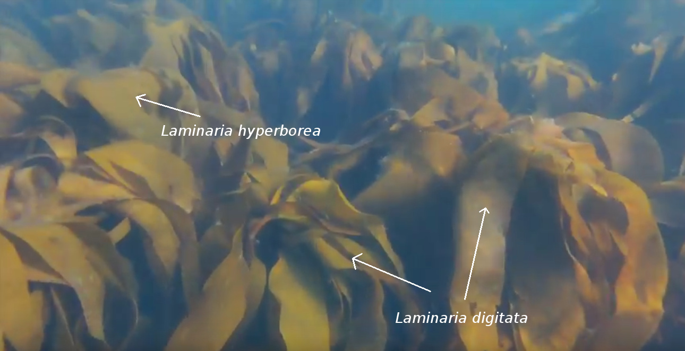
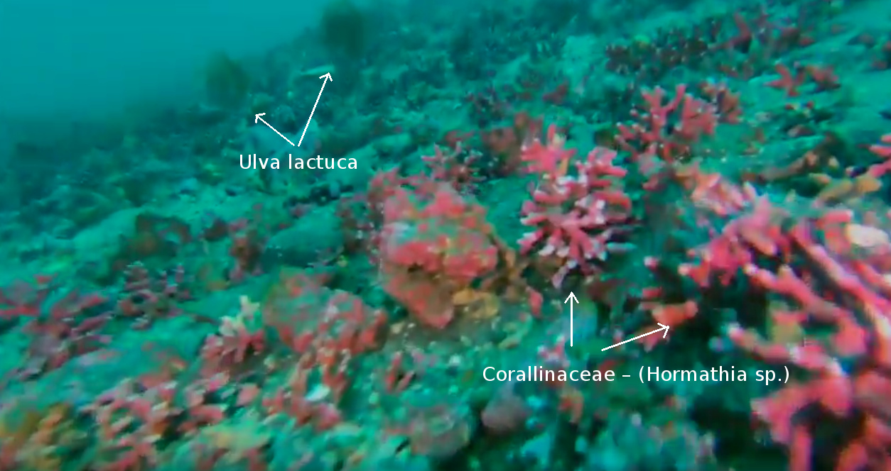

# Niðurstöður {#results}

Út frá myndskeiðunum sem tekin voru úti fyrir Finnstaðanesi mátti greina þarategundirnar stórþara (*L. hyperborea*) og hrossaþara (*L. digitata*) en einnig mátti sjá aðrar tegundir nytjaþörunga bregða fyrir t.d. söl *Palmaria palmata* (sjá mynd \@ref(fig:thari)). Einnig fannst reimaþang (*Himanthalia elongata*) í litlu magni og aðrar brúnþörungategundir sem finnast í fjörum og eru því aðgengilegar á fjöru.


```{r thari, fig.cap='Söl og þari (*laminaria* sp.) með ógreindum ásætum', out.width='60%', fig.align='center', echo=FALSE}

```

```{r thari1, fig.cap='Stórþari (*l. hyperborea*) og hrossaþari (*l. digitata)', out.width='60%', fig.align='center', echo=FALSE}

```

Rauðir botnþörungar (Corallinaceae) sem minna á kóralla og eru vel þekktir af sjómönnum bæjarins voru algengir í kringum þaraskóginn en nýting á þeim er ekki æskileg þar sem þeir eru svo hægvaxta að vinnsla með sjálfbærum hætti er ekki möguleg \@ref(fig:thari2).

```{r thari2, fig.cap='Maríusvunta og botnþörungar', out.width='60%', fig.align='center', echo=FALSE, fig.show = 'hold'}
knitr::include_graphics("myndir/bettina/Ulva_Corallinaceae_two_species.jpg")
```

```{r thari3, fig.cap='Maríusvunta og botnþörungar', out.width='60%', fig.align='center', echo=FALSE, fig.show = 'hold'}

```
