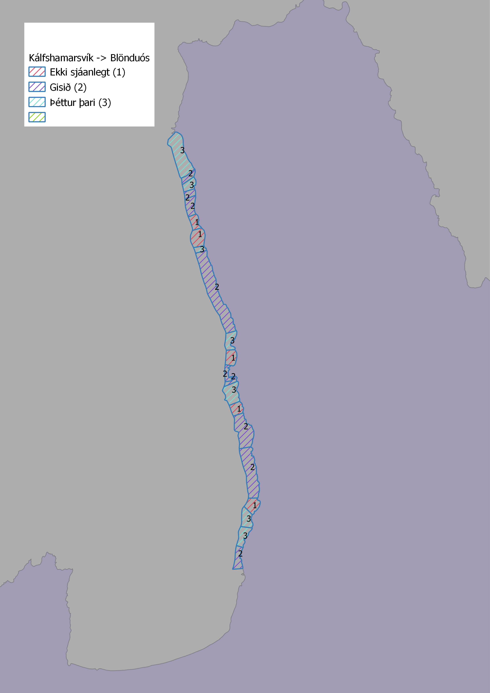

# Viðauki 1 {#v1}
## Þörungaleiðangur á sjókajak (forkönnun) - *Glósur úr feltbók*
### Þari meðfram ströndinni frá Skagaströnd að Ytriey


    - Heiðskýrt
    - Lítill vindur.
    
Talsverð þaraþekja var á um eins km bili frá Hrafná hálfa leið að Vindhælisstapa. En í sitthvorumegin við Vindhælisstapa var sendinn botn með litlum þara. Frá Hafursstaðakoti að Ytriey var þaragróður gisinn (*allt morandi í lunda við Ytriey og mikið af sel*)

***2. ágúst 2017. Ólafur Arason og Valtýr Sigurðsson***

### Þari frá Kálfshamarsvík að bænum Landsenda kortlagður. Lagt af stað frá Kálfshamarsvík klukkan 10:30 og siglt suður.

    - Létt skýjað og þoka, þokan var þó meiri inn til landsins.
    - Lítill vindur.
    - Háfjara var klukkan 09:20.


Upphafspunktur er merktur á kort 1 \@ref(fig:kort1). Frá upphafspunkti að stuðlabergi (kort 1) var sendinn botn og lítið um gróður. Svæði 1 var með þéttan og breiðan Hrossaþara- og Beltisþaraskóg og marinkjarna.  

Á svæði 2 var snöggdjúpt og skógurinn ekki jafn breiður og á svæði 1.  

Svæði 3 var við lítinn foss, þar var brimsamara og sendinn botn og lítið um þaragróður.

Út frá svæðinu milli 3 og 4 var lítið sker, sem var umlukið hrossa og beltisþara og marinkjarna skógi. Skerið sjálft var svo með fjöruþara (kló og klapparþang ofl.).

Svæði 4 er með hrossa- og beltisþaraskóg og marinkjarna, þykkt og þéttleiki svipaður og á svæði númer 2.

Svæði 5 er í fýlavarpi. Norðan Bjargarbjarga er mjög straumþungt og djúpt og lítill gróður, milli bjarganna og við suðurhluta Bjargarbjarga er grynning þar sem beltis og hrossaþari finnast. Hærra í fjörunni finnst klóþang og klapparþang. Við fossinn er straumhart og lítill gróður.

Svæði 6 var með þunnt lag af Marínkjarna og kerlingahári eða þangskeggi og var sá þari mjög gisinn.

Svæði 7 var við há björg og var botninn mjög snöggdjúpur og því nánast enginn þaragróður. Við Stráksnesið var grynning og þar var gróður mjög svipaður og á svæði 6.

Svæði 8 var með þunnan og gisinn marínkjarna líkt og svæði 6.

Svæði 9 var brimsamara og dýpkaði snöggt og því var lítill sem enginn gróður þar. Á svæðum 6 til 8 var lítið um kennileyti og því getur staðsetning þeirra svæða verið ónákæm  Komið var í land á Landsenda klukkan 14:40.

Skipt var um rannsóknarmann við Landsenda. Vindur jókst þegar leið á daginn en var undir 10 m/s (miðað við mælingar á Skagastrandarhöfn) þegar mest lét. Undiralda var nokkur svo að kajakinn snerist með hliðina í ölduna þegar var stoppað. Hvor rannsóknarmaður um sig sigldi um 10 km meðfram ströndinni. Lítið var um hrossa-/beltisþaraskóg á milli Landsenda og Skagastrandar. Sunnan við Landsenda var þéttur hrossaþarakógur og marinkjarni, á u.þ.b. 500 m kafla, og líka við Finnstaðanes. Svæðin voru annars gisin eða ber nema uppi við sker og þar sem grjót var á botni. Uppi í fjörum voru klappar- og bóluþangsbreiður.

***15. ágúst 2017. Ólafur Arason og Valtýr Sigurðsson***

```{r kort1, fig.cap='Könnunarsvæði úr kajakferðum í ágúst 2017', out.width='40%', fig.align='center', echo=FALSE, fig.show = 'hold'}

```

# Viðauki 2 {#v2}
## Bilanir á kafbát
Trident kafbáturinn barst okkur 20. júní 2018 og bilaði eftir tvær kafanir. Framleiðandinn sendi okkur nýjan eftir að hafa kannað orsök bilunarinnar sem virtist vera galli sem hann tók ábyrgð á. Nýja eintakið kom til okkar þann 8. ágúst. Tölvupóstsamskiptin við OpenRov sem framleiddi tækið eru látin fylgja á pdf-formi skýrslunnar. Athugið að tölvupóstsamskiptin eru í öfugri tímaröð.
\includepdf[pages={1-11}, scale=0.8]{skjol/bilanir.pdf}
