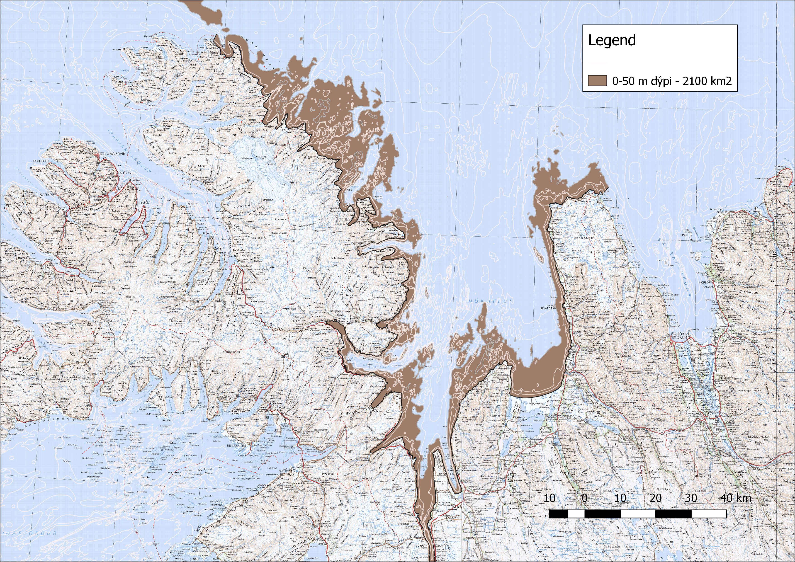

```{r setup, include=FALSE, cache=FALSE}
knitr::opts_chunk$set(echo = F, message=F, warning=F, error=F, comment=NA, R.options=list(width=220),   # code
                      dev.args=list(bg = 'transparent'), dev='svglite',                                 # viz
                      fig.align='center', out.width='75%', fig.asp=.75,                 
                      cache.rebuild=T, cache=T)                                                         # cache
```


# Inngangur
## Tilgangur verkefnis

Tilgangur verkefnisins er að gera forkönnun á nýtingu þaraskóga við austanverðan Húnaflóa, með áherslu á stórþara (*Laminaria hyperborea*), hrossaþara (*Laminaria digitata*) og beltisþara (*Laminaria saccharina*). Verkefninu er skipt upp í sýnatökur annars vegar og hins vegar áætlun um heildarmagn þara á svæðinu sem má vinna með sjálfbærum hætti.

## Úr verkefnislýsingu í styrkumsókn:

> „Grunnsævi Húnaflóa frá 5-40 metra dýpi verður kannað með köfun og fjarstýrðri neðansjávarmyndavél. Að forathugun lokinni, þar sem rannsóknarsvæði eru ákveðin, verða nokkur snið tekin við austanverðan flóann. Í Húnafirði, við Vatnsnes og í næsta nágrenni norðan við Skagaströnd.  
 Tvær manneskjur vinna samtímis að myndöflun. Myndefni verður tekið með köfun, úr fjöru og mótorbáti. Við myndöflun úr fjöru verða tekin snið 100 m út frá fjöruborði með reglulegu millibili. Kafað verður með myndavélina niður á 20 m dýpi þar sem þess gefst kostur. Úr mótorbáti verða teknar myndir á 40-50 m dýpi eftir fyrirfram ákveðnum sniðum. Myndavélin kafar á um tveggja hnúta hraða (3,7 km/klst) og er með 100 m langa snúru. Rafhlöðuending er 4 klst á sundi en lengri sé hún borin af kafara.
 Seinna verður myndefnið skoðað í landi og verður þari tegundagreindur og þekja þara metin. Mat á þekju er nákvæmara þar sem kafari stýrir myndatökunni. Fiskar verða greindir að næstu flokkunareiningu. Útbúið verður kort af þaraflórunni í forritinu [QGIS](https://www.qgis.org/en/site/) sem verður aðgengilegt á vefsvæði Biopol ehf.“

## Þari til nýtingar á Íslandi
Þari er samheiti yfir nokkrar tegundir brúnþörunga sem finnast á grunnsævi (allt að 30 metrum) í klappar, hnullunga og grjótfjörum við landið [@karl1997]. Fjölsykrur sem finna má í brúnþörungum eru mikið notaðar sem bindiefni í matvælum, snyrtivörum, lyfjaiðnaði, textiliðnaði og markskonar öðrum iðnaði. Hrossaþari (*L. digitata*) og beltisþari (*L. saccarina*) henta vel í framleiðslu á fjölsykrum en Þörungaverksmiðjan hf. á Reykhólum hefur þurrkað og malað hrossaþara og selt erlendis til alginatframleiðslu (alginat er fjölsykra). Einnig hefur fyrirtækið Purity Herbs á Akureyri notað hrossaþara frá Þörungaverksmiðjunni í sinni framleiðslu [@Jonsdottir2011].

## Um þaraskóga

Stórir þaraskógar finnast á grunnsævi á hærri breiddargráðum við lægri hita en 20°C. Uppistaða skóganna eru brúnþörungar af ættkvísl (*genus*) *Laminaria* og þá helst hrossaþari (*L. digitata*), stórþari (*L. hyperborea*), beltisþari (*L. saccharina*) og marinkjarni (*Alaria esculenta* (L.)). Þari þarf fast undilag til að festa sig við, grjót eða klappir, og þrífst því ekki á sand- eða leirbotni. Þari þarfnast sólarljóss sem orkugjafa sem takmarkar útbreiðslu þara niður fyrir ákveðið dýpi sem getur verið misjafnlega mikið eftir skyggni sjávarins en þari hefur fundist á 30 metra dýpi hér við land. Flatarmál grunnsævis undir 50 m í Húnaflóa er sýnt á mynd \ref{fig:fig1}.

```{r dypi,echo = FALSE,	fig.align = "center",	message = FALSE,	warning = FALSE,	out.width='100%',	error=FALSE, fig.cap='Grunnsævi í Húnaflóa undir 50 metrum.'}



```


Þari á sér náttúrulega óvini eins og ígulker og snigla. Ekki er endilega þari á stöðum sem þó fullnægja kröfum um festu og dýpi. Þarabreiður geta rifnað upp í miklu roki og erfitt er fyrir þarann að setjast aftur þar sem ígulkerin skrapa upp græðlinga. (Heimildir (Tharaskogar_Levington og thari í Vinnumappa/lesefni))

