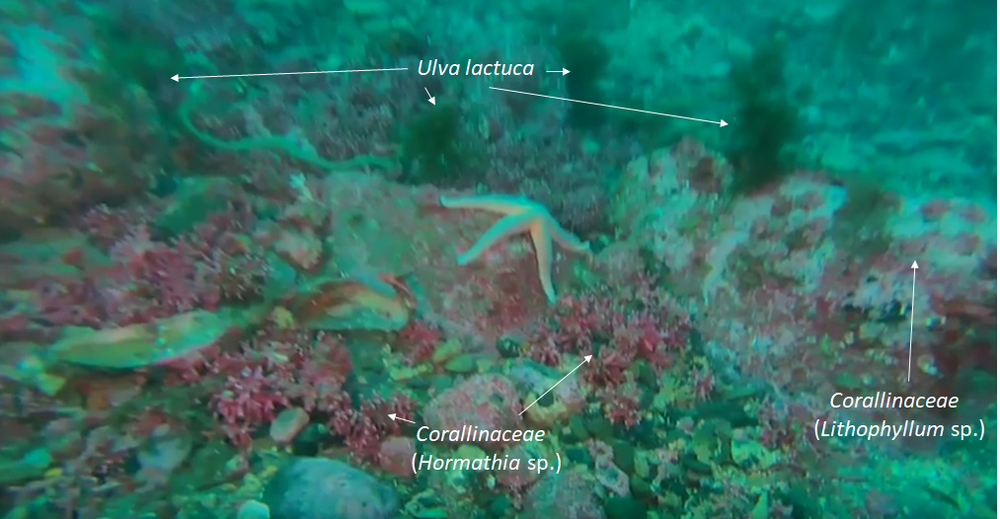

```{r setup, include=FALSE, cache=FALSE}
knitr::opts_chunk$set(echo = F, message=F, warning=F, error=F, comment=NA, R.options=list(width=220),   # code
                      dev.args=list(bg = 'transparent'), dev='svglite',                                 # viz
                      fig.align='center', out.width='75%', fig.asp=.75,                 
                      cache.rebuild=T, cache=T)                                                         # cache
```


# Inngangur
## Tilgangur verkefnis

Tilgangur verkefnisins er að gera forkönnun á nýtingu þaraskóga við austanverðan Húnaflóa, með áherslu á stórþara (*Laminaria hyperborea*), hrossaþara (*Laminaria digitata*) og beltisþara (*Laminaria saccharina*). Verkefninu er skipt upp í sýnatökur annars vegar og hins vegar áætlun um heildarmagn þara á svæðinu sem má vinna með sjálfbærum hætti.

## Úr verkefnislýsingu í styrkumsókn:

> „Grunnsævi Húnaflóa frá 5-40 metra dýpi verður kannað með köfun og fjarstýrðri neðansjávarmyndavél. Að forathugun lokinni, þar sem rannsóknarsvæði eru ákveðin, verða nokkur snið tekin við austanverðan flóann. Í Húnafirði, við Vatnsnes og í næsta nágrenni norðan við Skagaströnd.  
 Tvær manneskjur vinna samtímis að myndöflun. Myndefni verður tekið með köfun, úr fjöru og mótorbáti. Við myndöflun úr fjöru verða tekin snið 100 m út frá fjöruborði með reglulegu millibili. Kafað verður með myndavélina niður á 20 m dýpi þar sem þess gefst kostur. Úr mótorbáti verða teknar myndir á 40-50 m dýpi eftir fyrirfram ákveðnum sniðum. Myndavélin kafar á um tveggja hnúta hraða (3,7 km/klst) og er með 100 m langa snúru. Rafhlöðuending er 4 klst á sundi en lengri sé hún borin af kafara.
 Seinna verður myndefnið skoðað í landi og verður þari tegundagreindur og þekja þara metin. Mat á þekju er nákvæmara þar sem kafari stýrir myndatökunni. Fiskar verða greindir að næstu flokkunareiningu. Útbúið verður kort af þaraflórunni í forritinu [QGIS](https://www.qgis.org/en/site/) sem verður aðgengilegt á vefsvæði Biopol ehf.“

## Þari til nýtingar á Íslandi
Þari er samheiti yfir nokkrar tegundir brúnþörunga sem finnast á grunnsævi (allt að 30 metrum) í klappar, hnullunga og grjótfjörum við landið [@karl1997]. Fjölsykrur sem finna má í brúnþörungum eru mikið notaðar sem bindiefni í matvælum, snyrtivörum, lyfjaiðnaði, textiliðnaði og markskonar öðrum iðnaði. Hrossaþari (*L. digitata*) og beltisþari (*L. saccarina*) henta vel í framleiðslu á fjölsykrum en Þörungaverksmiðjan hf. á Reykhólum hefur þurrkað og malað hrossaþara og selt erlendis til alginatframleiðslu (alginat er fjölsykra). Einnig hefur fyrirtækið Purity Herbs á Akureyri notað hrossaþara frá Þörungaverksmiðjunni í sinni framleiðslu [@Jonsdottir2011].

<!--chapter:end:index.Rmd-->


# Forkönnun við Finnsstaðanes 2018

Ákveðið var að hefja forkönnun á hluta svæðisins á sjókajak dagana 2. og 15. ágúst 2017. Í fyrri ferðinni var farið á tveimur kajökum frá Skagaströnd til Eyjareyjar (um 6 km leið) en í seinni ferðinni var farið var frá Kálfshamarsvík til Skagastrandar (um 20 km leið) og skiptust þá tveir ræðarar á ([sjá Viðauka 1](#v1)). Nokkur svæði voru valin til frekari skoðunar með neðansjávarmyndavél, fjarstýrðum kafbáti (\@ref(fig:trident)). 

Þann 21. Júní 2018 var farið í fyrstu myndatökurnar en það vildi svo óheppilega til að kafbáturinn bilaði í þeirri ferð. Nýtt tæki var fengið rúmum mánuði seinna 8. ágúst ([sjá Viðauka 2](#v2)).

Þann 6. september 2018 var svæðið úti fyrir Finnstaðanesi kannað með kafbátnum. Farið var á báti björgunarsveitarinnar Strandar við fjórða mann. Myndskeið voru tekin upp frá 3 til 21 metra dýpis. Ferðin tók um eina og hálfa klukkustund en þá var undirritaður orðinn sjóveikur af því að stara á skjáinn og einnig var bilun í báðum mótorum bátsins. Myndefnið var greint af rannsóknarfólki BioPol til að bera kennsl á helstu tegundir í þaraskóginum.

```{r setup-options}
 knitr::opts_chunk$set(	echo = FALSE,	fig.align = "center",	message = FALSE,	warning = FALSE,	out.width='100%',	error=FALSE)
```

```{r trident, fig.cap='Tækið sem fékkst fyrir styrkféð frá SSNV kallast [Trident](https://www.openrov.com/) og er framleitt af OpenRov. Hér sést Karin Zech starfsmaður BioPol rýna á skjáinn á fjarstýringunni að tækinu og Guðmundur Björnsson fyrrv. grásleppuveiðimaður var okkur til halds og trausts. ', out.width='35%', fig.show = 'hold'}

knitr::include_graphics(c("myndir/Trident_litil.jpg","myndir/karin.jpg"))
```


# Forkönnun við Eyrina 2019 (kajak)

Þann 11. júní 2019 fór undirritaður á kajak frá Hrafná innan við Skagaströnd til að kanna mörk þaraskógarins á milli Eyrarinnar og Skeljatanga (sjá kort). Daginn eftir var farið út á sama svæði, á kajak, með drónann til að athuga tegundasamsetningu þarans og vöxt. Kajakinn var bundinn við netabauju til að reka ekki og myndir teknar með drónanum í kringum baujuna. **Setja inn myndir og hlekk á vídjó**


```{r mapviewskA, fig.cap='Siglt var á kajak upp að bauju við grásleppunet (sem notuð var sem ankeri) á milli Eyrarinnar og Skeljatanga rétt innan við Skagaströnd. Tekin voru myndskeið til að greina tegundir þara og meta vöxt hans.'}

library(XML)
library(OpenStreetMap)
library(lubridate)
library(raster)
library(sp)
shift.vec <- function (vec, shift) {
  if(length(vec) <= abs(shift)) {
    rep(NA ,length(vec))
  }else{
    if (shift >= 0) {
      c(rep(NA, shift), vec[1:(length(vec)-shift)]) }
    else {
      c(vec[(abs(shift)+1):length(vec)], rep(NA, abs(shift))) } } }

col1 <- seq(0,100,5)
col2 <- seq(200, 100, -5)
my_df <- data.frame(c1= col1, c2= col2)
my_df$nc1 <- shift.vec(my_df$c1, -1)
my_df$nc2 <- shift.vec(my_df$c2, -1)

options(digits=10)
# Parse the GPX file
pfile <- htmlTreeParse(file = "skjol/Current.gpx", error = function(...) {
}, useInternalNodes = T)

elevations <- as.numeric(xpathSApply(pfile, path = "//trkpt/ele", xmlValue))
times <- xpathSApply(pfile, path = "//trkpt/time", xmlValue)
coords <- xpathSApply(pfile, path = "//trkpt", xmlAttrs)

#str(coords)

lats <- as.numeric(coords["lat",])
lons <- as.numeric(coords["lon",])

geodf <- data.frame(lat = lats, lon = lons, ele = elevations, time = times)
rm(list=c("elevations", "lats", "lons", "pfile", "times", "coords"))
#geodf <- geodf[isoyear(geodf$time)>2018,]
geodf <- geodf[680:1153,]
#head(geodf)


geodf$lat.p1 <- shift.vec(geodf$lat, -1)
geodf$lon.p1 <- shift.vec(geodf$lon, -1)
#head(geodf)

geodf$dist.to.prev <- apply(geodf, 1, FUN = function (row) {
  pointDistance(c(as.numeric(row["lat.p1"]),
                  as.numeric(row["lon.p1"])),
                c(as.numeric(row["lat"]), as.numeric(row["lon"])),
                lonlat = T)
})

#head(geodf$dist.to.prev)

td <- sum(geodf$dist.to.prev, na.rm=TRUE)
#print(paste("Róið var", td, "metra"))

geodf$time <- strptime(geodf$time, format = "%Y-%m-%dT%H:%M:%OS")
# Shift the time vector, too.
geodf$time.p1 <- shift.vec(geodf$time, -1)
# Calculate the number of seconds between two positions.
geodf$time.diff.to.prev <- as.numeric(difftime(geodf$time.p1, geodf$time))

#head(geodf$time.diff.to.prev, n=15) 

geodf$speed.m.per.sec <- geodf$dist.to.prev / geodf$time.diff.to.prev
geodf$speed.km.per.h <- geodf$speed.m.per.sec * 3.6
geodf$speed.km.per.h <- ifelse(is.na(geodf$speed.km.per.h), 0, geodf$speed.km.per.h)
geodf$lowess.speed <- lowess(geodf$speed.km.per.h, f = 0.2)$y
geodf$lowess.ele <- lowess(geodf$ele, f = 0.2)$y

# plot(geodf$speed.km.per.h, type = "l", bty = "n", xaxt = "n", ylab = "Hraði (km/h)", xlab = "",
#      col = "grey40")
# lines(geodf$lowess.speed, col = "blue", lwd = 3)
# legend(x="topright", legend = c("GPS hraði", "LOWESS hraði"),
#        col = c("grey40", "blue"), lwd = c(1,3), bty = "n")
# abline(h = mean(geodf$speed.km.per.h), lty = 2, col = "blue")
# 
# plot(rev(geodf$lon), rev(geodf$lat), type = "l", col = "red", lwd = 3, bty = "n", ylab = "Latitude", xlab = "Longitude")

library(mapview)
#class(geodf)

kajak <- geodf
coordinates(kajak) <- ~ lon + lat
proj4string(kajak) <- "+init=epsg:4326"
#class(spdf_geo)
sk1 <- rgdal::readOGR(dsn="skjol/skogar/sk1/sk1.shp",verbose = FALSE)
mapview(kajak,color="red",col.regions="grey",map.types="Esri.WorldImagery")+mapview(sk1,color="red",col.regions="grey")

#mapview(spdf_geo,map.types="Esri.WorldImagery")


```


# Stekkjavík og Sölvabakki 2019

Farið var á Zodiac inn að Sölvabakka föstudaginn 21. júní. Báturinn er í eigu björgunarsveitrinnar Stráka á Skagaströnd, Einn maður um borð og var Trident kafbáturinn meðferðis. Kafbáturinn var settur niður á þremur stöðum á milli Stekkjavíkur og Sölvabakka. Hlekkur á möppu með [myndskeiðum](https://www.dropbox.com/sh/pcobg1zexnhsm9r/AABOmyp9I87GbuT6qs3SRxWDa?dl=0)

```{r mapviewskB,echo = FALSE,	fig.align = "center",	message = FALSE,	warning = FALSE,	out.width='100%',	error=FALSE}


library(XML)
library(OpenStreetMap)
library(lubridate)
library(raster)
library(sp)
shift.vec <- function (vec, shift) {
  if(length(vec) <= abs(shift)) {
    rep(NA ,length(vec))
  }else{
    if (shift >= 0) {
      c(rep(NA, shift), vec[1:(length(vec)-shift)]) }
    else {
      c(vec[(abs(shift)+1):length(vec)], rep(NA, abs(shift))) } } }

col1 <- seq(0,100,5)
col2 <- seq(200, 100, -5)
my_df <- data.frame(c1= col1, c2= col2)
my_df$nc1 <- shift.vec(my_df$c1, -1)
my_df$nc2 <- shift.vec(my_df$c2, -1)

options(digits=10)
# Parse the GPX file
pfile <- htmlTreeParse(file = "skjol/skogar/sk2/Current.gpx", error = function(...) {
}, useInternalNodes = T)

elevations <- as.numeric(xpathSApply(pfile, path = "//trkpt/ele", xmlValue))
times <- xpathSApply(pfile, path = "//trkpt/time", xmlValue)
coords <- xpathSApply(pfile, path = "//trkpt", xmlAttrs)

#str(coords)

lats <- as.numeric(coords["lat",])
lons <- as.numeric(coords["lon",])

geodf <- data.frame(lat = lats, lon = lons, ele = elevations, time = times)
rm(list=c("elevations", "lats", "lons", "pfile", "times", "coords"))
#geodf <- geodf[isoyear(geodf$time)>2018,]
#geodf <- geodf[680:1153,]
#head(geodf)


geodf$lat.p1 <- shift.vec(geodf$lat, -1)
geodf$lon.p1 <- shift.vec(geodf$lon, -1)
#head(geodf)

geodf$dist.to.prev <- apply(geodf, 1, FUN = function (row) {
  pointDistance(c(as.numeric(row["lat.p1"]),
                  as.numeric(row["lon.p1"])),
                c(as.numeric(row["lat"]), as.numeric(row["lon"])),
                lonlat = T)
})

#head(geodf$dist.to.prev)

td <- sum(geodf$dist.to.prev, na.rm=TRUE)
#print(paste("Róið var", td, "metra"))

geodf$time <- strptime(geodf$time, format = "%Y-%m-%dT%H:%M:%OS")
# Shift the time vector, too.
geodf$time.p1 <- shift.vec(geodf$time, -1)
# Calculate the number of seconds between two positions.
geodf$time.diff.to.prev <- as.numeric(difftime(geodf$time.p1, geodf$time))

#head(geodf$time.diff.to.prev, n=15) 

geodf$speed.m.per.sec <- geodf$dist.to.prev / geodf$time.diff.to.prev
geodf$speed.km.per.h <- geodf$speed.m.per.sec * 3.6
geodf$speed.km.per.h <- ifelse(is.na(geodf$speed.km.per.h), 0, geodf$speed.km.per.h)
geodf$lowess.speed <- lowess(geodf$speed.km.per.h, f = 0.2)$y
geodf$lowess.ele <- lowess(geodf$ele, f = 0.2)$y

# plot(geodf$speed.km.per.h, type = "l", bty = "n", xaxt = "n", ylab = "Hraði (km/h)", xlab = "",
#      col = "grey40")
# lines(geodf$lowess.speed, col = "blue", lwd = 3)
# legend(x="topright", legend = c("GPS hraði", "LOWESS hraði"),
#        col = c("grey40", "blue"), lwd = c(1,3), bty = "n")
# abline(h = mean(geodf$speed.km.per.h), lty = 2, col = "blue")
# 
# plot(rev(geodf$lon), rev(geodf$lat), type = "l", col = "red", lwd = 3, bty = "n", ylab = "Latitude", xlab = "Longitude")

library(mapview)

Zodiac <- geodf
coordinates(Zodiac) <- ~ lon + lat
proj4string(Zodiac) <- "+init=epsg:4326"
Dypi<- rgdal::readOGR(dsn="skjol/skogar/sk2/klipp.shp", verbose = FALSE)
stodvar<- sf::read_sf(dsn="skjol/skogar/sk2/stodvar")
library(RColorBrewer)
pal <- colorRampPalette(brewer.pal(length(unique(Dypi@data$MinZ)), "Blues"))
mapview(Zodiac,color="red",col.regions="grey",map.types="Esri.WorldImagery")+mapview(Dypi,zcol="MinZ",color = pal, lwd=0.8)+mapview(stodvar)


```

## Stöð 1

```{r mynd-sk-tvo-stod-eitt,echo = FALSE,	fig.align = "center",	message = FALSE,	warning = FALSE,	out.width='100%',	error=FALSE, fig.cap='Talsvert af *þangskeggi* en einnig sést í öðuskel (*Modiola modiolus*) '}

knitr::include_graphics("skjol/skogar/sk2/stodvar/st1/sk2-st1.jpg")

```

```{r mynd-sk-tvo-stod-eittB,echo = FALSE,	fig.align = "center",	message = FALSE,	warning = FALSE,	out.width='100%',	error=FALSE, fig.cap='Myndir frá stöð eitt á korti við Stekkjavík og Sölvabakka. Botninn er sendinn með grjóti hér og þar. Sandmaðkshraukar (*Arenicola marina*) og kúfskeljar (*Arctica islandica*) í miklu magni.'}

knitr::include_graphics("skjol/skogar/sk2/stodvar/st1/sk2-st1B.jpg")

```

```{r mynd-sk-tvo-stod-tvo,echo = FALSE,	fig.align = "center",	message = FALSE,	warning = FALSE,	out.width='100%',	error=FALSE, fig.cap='Myndir frá stöð eitt á korti við Stekkjavík og Sölvabakka. Botninn er sendinn með grjóti hér og þar. Sandmaðkshraukar (*Arenicola marina*) og kúfskeljar (*Arctica islandica*) í miklu magni.'}

knitr::include_graphics("skjol/skogar/sk2/stodvar/st2/sk2-st2.jpeg")

```


```{r mynd-sk-tvo-stod-tvoB,echo = FALSE,	fig.align = "center",	message = FALSE,	warning = FALSE,	out.width='100%',	error=FALSE, fig.cap='Myndir frá stöð eitt á korti við Stekkjavík og Sölvabakka. Botninn er sendinn með grjóti og klöppum hér og þar. Skeljabrot og leifar af kísilþörungum (*Lithothamnion*) sem ígulker hafa líklega skrapað upp.'}

knitr::include_graphics("skjol/skogar/sk2/stodvar/st2/sk2-st2B.jpeg")

```


# Forkönnun við Hamarsbúð og Sölvabakka 2019

Rannsóknarmenn voru undirritaður og Einar Þorleifsson. Báturinn var sjósettur í fjöru við Hamarsbúð á vestanverðu Vatnsnesi norðan við Hvammstanga. Siglt var í 3-4 kílómetra norður að fyrirætluðum sýnatökustað og virtist vera nokkuð samfelld þarabreiða alla leiðina. 

[Hlekkur](https://www.dropbox.com/sh/rodn0wueqkjfz1i/AAALWpzgA0WOKZcknNURKd1Ia?dl=0)


```{r mapviewskC}

library(mapview)
Dypi<- rgdal::readOGR(dsn="skjol/skogar/sk3/klipp.shp", verbose = FALSE)
stodvar<- sf::read_sf(dsn="skjol/skogar/sk3/punktar.shp")
leid<- sf::read_sf(dsn="skjol/skogar/sk3/Current.GPX",layer="tracks")
library(RColorBrewer)
pal <- colorRampPalette(brewer.pal(length(unique(Dypi@data$MinZ)), "Blues"))
map <- mapview(Dypi,map.types="Esri.WorldImagery",zcol="MinZ",color = pal) + mapview(leid) + mapview(stodvar,type="l")
library(magrittr)
img <- "https://github.com/harkanatta/ssnv_trident/blob/master/graphs/tvologo.jpg?raw=true"
map %>% leafem::addLogo(img, width = 265/2, height = 200/2,offset.y = 20,offset.x = 80,alpha = 0.7) %>% leaflet.extras::addFullscreenControl(pseudoFullscreen = T)
```

Marinkjarni (Alaria esculenta) 
```{r mynd-sk-thrju-stod-tvo,echo = FALSE,	fig.align = "center",	message = FALSE,	warning = FALSE,	out.width='100%',	error=FALSE, fig.cap='Myndir frá stöð eitt á korti við Stekkjavík og Sölvabakka. Botninn er sendinn með grjóti og klöppum hér og þar. Skeljabrot og leifar af kísilþörungum (*Lithothamnion*) sem ígulker hafa líklega skrapað upp.'}

knitr::include_graphics("skjol/skogar/sk3/stodvar/st2/sk3-st2.jpg")

```

Marinkjarni (Alaria esculenta) 
```{r mynd-sk-thrju-stod-tvoB,echo = FALSE,	fig.align = "center",	message = FALSE,	warning = FALSE,	out.width='100%',	error=FALSE, fig.cap='Hrossaþari eða stórþari (*Laminaria digitata* eða *Laminaria hyperborea*)'}


```

Marinkjarni (Alaria esculenta) 
```{r mynd-sk-thrju-stod-tvoC,echo = FALSE,	fig.align = "center",	message = FALSE,	warning = FALSE,	out.width='100%',	error=FALSE, fig.cap='Myndir frá stöð eitt á korti við Stekkjavík og Sölvabakka. Botninn er sendinn með grjóti og klöppum hér og þar. Skeljabrot og leifar af kísilþörungum (*Lithothamnion*) sem ígulker hafa líklega skrapað upp.'}

knitr::include_graphics("skjol/skogar/sk3/stodvar/st2/sk3-st2C.jpg")

```

# Forkönnun við Hofsgrunn 2019
Við Addi... 

 


```{r mapviewskD}

library(XML)
library(OpenStreetMap)
library(lubridate)
library(raster)
library(sp)
shift.vec <- function (vec, shift) {
  if(length(vec) <= abs(shift)) {
    rep(NA ,length(vec))
  }else{
    if (shift >= 0) {
      c(rep(NA, shift), vec[1:(length(vec)-shift)]) }
    else {
      c(vec[(abs(shift)+1):length(vec)], rep(NA, abs(shift))) } } }
#"(setja inn 'C:/Users/BioPol VS/Documents/Vinnumappa/GIS/Isl_dlin_shape/Isl_dyp_lin_290115.shp')"
col1 <- seq(0,100,5)
col2 <- seq(200, 100, -5)
my_df <- data.frame(c1= col1, c2= col2)
my_df$nc1 <- shift.vec(my_df$c1, -1)
my_df$nc2 <- shift.vec(my_df$c2, -1)

options(digits=10)
# Parse the GPX file
pfile <- htmlTreeParse(file = "skjol/skogar/sk4/Current.gpx", error = function(...) {
}, useInternalNodes = T)

elevations <- as.numeric(xpathSApply(pfile, path = "//trkpt/ele", xmlValue))
times <- xpathSApply(pfile, path = "//trkpt/time", xmlValue)
coords <- xpathSApply(pfile, path = "//trkpt", xmlAttrs)

#str(coords)

lats <- as.numeric(coords["lat",])
lons <- as.numeric(coords["lon",])

geodf <- data.frame(lat = lats, lon = lons, ele = elevations, time = times)
rm(list=c("elevations", "lats", "lons", "pfile", "times", "coords"))
#geodf <- geodf[isoyear(geodf$time)>2018,]
geodf <- geodf[170:1800,]
#head(geodf)


geodf$lat.p1 <- shift.vec(geodf$lat, -1)
geodf$lon.p1 <- shift.vec(geodf$lon, -1)
#head(geodf)

geodf$dist.to.prev <- apply(geodf, 1, FUN = function (row) {
  pointDistance(c(as.numeric(row["lat.p1"]),
                  as.numeric(row["lon.p1"])),
                c(as.numeric(row["lat"]), as.numeric(row["lon"])),
                lonlat = T)
})

#head(geodf$dist.to.prev)

td <- sum(geodf$dist.to.prev, na.rm=TRUE)
#print(paste("Róið var", td, "metra"))

geodf$time <- strptime(geodf$time, format = "%Y-%m-%dT%H:%M:%OS")
# Shift the time vector, too.
geodf$time.p1 <- shift.vec(geodf$time, -1)
# Calculate the number of seconds between two positions.
geodf$time.diff.to.prev <- as.numeric(difftime(geodf$time.p1, geodf$time))

#head(geodf$time.diff.to.prev, n=15) 

geodf$speed.m.per.sec <- geodf$dist.to.prev / geodf$time.diff.to.prev
geodf$speed.km.per.h <- geodf$speed.m.per.sec * 3.6
geodf$speed.km.per.h <- ifelse(is.na(geodf$speed.km.per.h), 0, geodf$speed.km.per.h)
geodf$lowess.speed <- lowess(geodf$speed.km.per.h, f = 0.2)$y
geodf$lowess.ele <- lowess(geodf$ele, f = 0.2)$y

# plot(geodf$speed.km.per.h, type = "l", bty = "n", xaxt = "n", ylab = "Hraði (km/h)", xlab = "",
#      col = "grey40")
# lines(geodf$lowess.speed, col = "blue", lwd = 3)
# legend(x="topright", legend = c("GPS hraði", "LOWESS hraði"),
#        col = c("grey40", "blue"), lwd = c(1,3), bty = "n")
# abline(h = mean(geodf$speed.km.per.h), lty = 2, col = "blue")
# 
# plot(rev(geodf$lon), rev(geodf$lat), type = "l", col = "red", lwd = 3, bty = "n", ylab = "Latitude", xlab = "Longitude")


library(mapview)
Zodiac <- geodf
coordinates(Zodiac) <- ~ lon + lat
proj4string(Zodiac) <- "+init=epsg:4326"
Dypi<- rgdal::readOGR(dsn="skjol/skogar/sk4/klipp.shp", verbose = FALSE)
library(RColorBrewer)
pal <- colorRampPalette(brewer.pal(length(unique(Dypi@data$MinZ)), "Blues"))
mapview(Zodiac,color="red",col.regions="grey",map.types="Esri.WorldImagery")+mapview(Dypi,zcol="MinZ",color = pal)


```

<!--chapter:end:01-frmkvmd.Rmd-->

# Niðurstöður {#results}

Út frá myndskeiðunum sem tekin voru úti fyrir Finnstaðanesi mátti greina þarategundirnar stórþara (*L. hyperborea*) og hrossaþara (*L. digitata*) en einnig mátti sjá aðrar tegundir nytjaþörunga bregða fyrir t.d. söl *Palmaria palmata* (sjá mynd \@ref(fig:thari)). Einnig fannst reimaþang (*Himanthalia elongata*) í litlu magni og aðrar brúnþörungategundir sem finnast í fjörum og eru því aðgengilegar á fjöru.


```{r thari, fig.cap='Söl og þari (*laminaria* sp.) með ógreindum ásætum', out.width='60%', fig.align='center', echo=FALSE}
knitr::include_graphics("myndir/bettina/Laminaria-Palmaria-epiphytes.jpg")
```

```{r thari1, fig.cap='Stórþari (*l. hyperborea*) og hrossaþari (*l. digitata)', out.width='60%', fig.align='center', echo=FALSE}
knitr::include_graphics("myndir/bettina/Laminaria.jpg")
```

Rauðir botnþörungar (Corallinaceae) sem minna á kóralla og eru vel þekktir af sjómönnum bæjarins voru algengir í kringum þaraskóginn en nýting á þeim er ekki æskileg þar sem þeir eru svo hægvaxta að vinnsla með sjálfbærum hætti er ekki möguleg \@ref(fig:thari2).

```{r thari2, fig.cap='Maríusvunta og botnþörungar', out.width='60%', fig.align='center', echo=FALSE, fig.show = 'hold'}

```

```{r thari3, fig.cap='Maríusvunta og botnþörungar', out.width='60%', fig.align='center', echo=FALSE, fig.show = 'hold'}
knitr::include_graphics("myndir/bettina/fleirikorallarogulva.jpg")
```

<!--chapter:end:02-nidurst.Rmd-->

# Umræður

## Kafbáturinn
Kafbáturinn tekur upp myndefni af miklum gæðum og er stöðugur á siglingu. Rannsakendur eiga gott með að greina tegundir út frá myndefninu. Myndefnið hefur vakið áhuga annara rannsakenda í skyldum verkefnum. Fyrir utan bilun sem orsakaðist af framleiðslugalla hefur hann mætt okkar vonum og gott betur.

## Mat á stærð þaraskóga m.t.t. nýtingar
Mat á stærð skóganna verður áætlað eftir megni en skógurinn milli Eyrarinnar og Skeljatanga (sk1) er um 0,5 km^2^

## Seinkanir og áframhaldandi sýnatökur
Sumarið 2018 var óvenjulegt af því leyti að við vorum fámönnuð. Rannsóknabáturinn okkar var mikið í öðrum verkefnum og þess utan var rigningasamt þannig að ekki var gott að vera úti við með raftæki (en fjarstýringin af kafbátnum er venjuleg spjaldtölva). Við hjá BioPol höfum metnað fyrir því að klára þetta verkefni og fengum eins árs frest til að skila af okkur lokaskýrslu og því er rannsóknum haldið áfram sumarið 2019.  Kafbátnum er að mestu stýrt úr Zodiac gúmmíbáti. Sýnatökustaðir af svæðum þar sem forkönnun hefur ekki farið fram (innan við Ytriey og Vatnsnes) verður gerð eftir samráði við gamla grásleppukarla af svæðinu en veiðiaðferðir þeirra voru á þann máta að vitneskja um þaraskóga var þeim nauðsynleg áður fyrr og því geta þeir bent á áhugaverðustu svæðin.

<!--chapter:end:03-Umr.Rmd-->

# Viðauki 1 {#v1}
## Þörungaleiðangur á sjókajak (forkönnun) - *Glósur úr feltbók*
### Þari meðfram ströndinni frá Skagaströnd að Ytriey


    - Heiðskýrt
    - Lítill vindur.
    
Talsverð þaraþekja var á um eins km bili frá Hrafná hálfa leið að Vindhælisstapa. En í sitthvorumegin við Vindhælisstapa var sendinn botn með litlum þara. Frá Hafursstaðakoti að Ytriey var þaragróður gisinn (*allt morandi í lunda við Ytriey og mikið af sel*)

***2. ágúst 2017. Ólafur Arason og Valtýr Sigurðsson***

### Þari frá Kálfshamarsvík að bænum Landsenda kortlagður. Lagt af stað frá Kálfshamarsvík klukkan 10:30 og siglt suður.

    - Létt skýjað og þoka, þokan var þó meiri inn til landsins.
    - Lítill vindur.
    - Háfjara var klukkan 09:20.


Upphafspunktur er merktur á kort 1 \@ref(fig:kort1). Frá upphafspunkti að stuðlabergi (kort 1) var sendinn botn og lítið um gróður. Svæði 1 var með þéttan og breiðan Hrossaþara- og Beltisþaraskóg og marinkjarna.  

Á svæði 2 var snöggdjúpt og skógurinn ekki jafn breiður og á svæði 1.  

Svæði 3 var við lítinn foss, þar var brimsamara og sendinn botn og lítið um þaragróður.

Út frá svæðinu milli 3 og 4 var lítið sker, sem var umlukið hrossa og beltisþara og marinkjarna skógi. Skerið sjálft var svo með fjöruþara (kló og klapparþang ofl.).

Svæði 4 er með hrossa- og beltisþaraskóg og marinkjarna, þykkt og þéttleiki svipaður og á svæði númer 2.

Svæði 5 er í fýlavarpi. Norðan Bjargarbjarga er mjög straumþungt og djúpt og lítill gróður, milli bjarganna og við suðurhluta Bjargarbjarga er grynning þar sem beltis og hrossaþari finnast. Hærra í fjörunni finnst klóþang og klapparþang. Við fossinn er straumhart og lítill gróður.

Svæði 6 var með þunnt lag af Marínkjarna og kerlingahári eða þangskeggi og var sá þari mjög gisinn.

Svæði 7 var við há björg og var botninn mjög snöggdjúpur og því nánast enginn þaragróður. Við Stráksnesið var grynning og þar var gróður mjög svipaður og á svæði 6.

Svæði 8 var með þunnan og gisinn marínkjarna líkt og svæði 6.

Svæði 9 var brimsamara og dýpkaði snöggt og því var lítill sem enginn gróður þar. Á svæðum 6 til 8 var lítið um kennileyti og því getur staðsetning þeirra svæða verið ónákæm  Komið var í land á Landsenda klukkan 14:40.

Skipt var um rannsóknarmann við Landsenda. Vindur jókst þegar leið á daginn en var undir 10 m/s (miðað við mælingar á Skagastrandarhöfn) þegar mest lét. Undiralda var nokkur svo að kajakinn snerist með hliðina í ölduna þegar var stoppað. Hvor rannsóknarmaður um sig sigldi um 10 km meðfram ströndinni. Lítið var um hrossa-/beltisþaraskóg á milli Landsenda og Skagastrandar. Sunnan við Landsenda var þéttur hrossaþarakógur og marinkjarni, á u.þ.b. 500 m kafla, og líka við Finnstaðanes. Svæðin voru annars gisin eða ber nema uppi við sker og þar sem grjót var á botni. Uppi í fjörum voru klappar- og bóluþangsbreiður.

***15. ágúst 2017. Ólafur Arason og Valtýr Sigurðsson***

```{r kort1, fig.cap='Könnunarsvæði úr kajakferðum í ágúst 2017', out.width='40%', fig.align='center', echo=FALSE, fig.show = 'hold'}
knitr::include_graphics(c("myndir/feltkort/kort1.jpg","myndir/feltkort/kort2.jpg","myndir/feltkort/kort3.jpg","myndir/feltkort/kort4.jpg"))
```

# Viðauki 2 {#v2}
## Bilanir á kafbát
Trident kafbáturinn barst okkur 20. júní 2018 og bilaði eftir tvær kafanir. Framleiðandinn sendi okkur nýjan eftir að hafa kannað orsök bilunarinnar sem virtist vera galli sem hann tók ábyrgð á. Nýja eintakið kom til okkar þann 8. ágúst. Tölvupóstsamskiptin við OpenRov sem framleiddi tækið eru látin fylgja á pdf-formi skýrslunnar. Athugið að tölvupóstsamskiptin eru í öfugri tímaröð.
\includepdf[pages={1-11}, scale=0.8]{skjol/bilanir.pdf}

<!--chapter:end:appendix.Rmd-->

`r if (knitr::is_html_output()) '# Heimildir {-}'`

```{r include=FALSE}
# automatically create a bib database for R packages
knitr::write_bib(c(
  .packages(), 'bookdown', 'knitr', 'rmarkdown'
), 'packages.bib')
```

<!--chapter:end:references.Rmd-->

