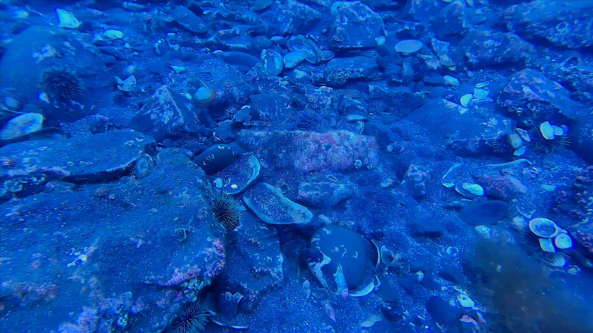

```{r setup, include=FALSE, cache=FALSE}
knitr::opts_chunk$set(echo = F, message=F, warning=F, error=F, comment=NA, R.options=list(width=220),   # code
                      dev.args=list(bg = 'transparent'), dev='svglite',                                 # viz
                      fig.align='center', out.width='75%', fig.asp=.75,                 
                      cache.rebuild=T, cache=T)                                                         # cache
```


# Inngangur
## Tilgangur verkefnis

Tilgangur verkefnisins er að gera forkönnun á nýtingu þaraskóga við austanverðan Húnaflóa, með áherslu á stórþara (*Laminaria hyperborea*), hrossaþara (*Laminaria digitata*) og beltisþara (*Laminaria saccharina*). Verkefninu er skipt upp í sýnatökur annars vegar og hins vegar áætlun um heildarmagn þara á svæðinu sem má vinna með sjálfbærum hætti.


## Þari til nýtingar á Íslandi
Þari er samheiti yfir nokkrar tegundir brúnþörunga sem finnast á grunnsævi (allt að 30 metrum) í klappar, hnullunga og grjótfjörum við landið [@karl1997]. Þari er nýttur í yfir 30 löndum og er árleg uppskera yfir 800 þúsund tonn á heimsvísu [@Monagail2017]. Fjölsykrur sem finna má í brúnþörungum eru mikið notaðar sem bindiefni í matvælum, snyrtivörum, lyfjaiðnaði, textíliðnaði og markskonar öðrum iðnaði. Hrossaþari (*L. digitata*) og beltisþari (*L. saccarina*) henta vel í framleiðslu á fjölsykrum en Þörungaverksmiðjan hf. á Reykhólum hefur þurrkað og malað hrossaþara og selt erlendis til alginatframleiðslu (alginat er fjölsykra). Einnig hefur fyrirtækið Purity Herbs á Akureyri notað hrossaþara frá Þörungaverksmiðjunni í sinni framleiðslu [@Jonsdottir2011]. 

## Um þaraskóga

Stórir þaraskógar finnast á grunnsævi á hærri breiddargráðum við lægri hita en 20°C. Uppistaða skóganna eru brúnþörungar af ættkvísl (*genus*) *Laminaria* og þá helst hrossaþari (*L. digitata*), stórþari (*L. hyperborea*), beltisþari (*L. saccharina*) og marinkjarni (*Alaria esculenta* (L.)). Þari þarf fast undilag til að festa sig við, grjót eða klappir, og þrífst því ekki á sand- eða leirbotni. Þari þarfnast sólarljóss sem orkugjafa sem takmarkar útbreiðslu þara niður fyrir ákveðið dýpi sem getur verið misjafnlega mikið eftir skyggni sjávarins en þari hefur fundist á 30 metra dýpi hér við land [@karl1997]. 

Notast hefur verið við loftmyndir úr gervihnöttum og dróna til að meta þangútbreiðslu [@Gunnarsson2017] en vandasamt er að meta útbreiðslu þara þar sem loftmyndir í nægjanlegum gæðum eru af skornum skammti og oft er glampi af haffletinum eða skýjahula sem þekur myndirnar.


Þari á sér náttúrulega óvini eins og ígulker og snigla og því er ekki endilega þara að finna á stöðum sem þó fullnægja kröfum um festu og dýpi. Þarabreiður geta líka rifnað upp í miklu roki og erfitt er fyrir þarann að setjast aftur þar sem ígulkerin skrapa upp græðlinga. Þess vegna var ákveðið að kanna þarabreiður með neðansjávarmyndavél, fjarstýrðum kafbáti (\@ref(fig:trident)), í þessu verkefni.  

```{r trident, fig.cap='Tækið sem fékkst fyrir styrkféð frá SSNV kallast [Trident](https://www.openrov.com/) og er framleitt af OpenRov. Hér sést Karin Zech starfsmaður BioPol rýna á skjáinn á fjarstýringunni að tækinu og Guðmundur Björnsson fyrrv. grásleppuveiðimaður var okkur til halds og trausts. ', out.width='35%', fig.show = 'hold'}

knitr::include_graphics(c("myndir/Trident_litil.jpg","myndir/karin.jpg"))
```


# Framkvæmd


## Sýnatökur
Ákveðið var að hefja forkönnun á hluta svæðisins á sjókajak dagana 2. og 15. ágúst 2017. Í fyrri ferðinni var farið á tveimur kajökum frá Skagaströnd til Eyjareyjar (um 6 km leið) en í seinni ferðinni var farið var frá Kálfshamarsvík til Skagastrandar (um 20 km leið) og skiptust þá tveir ræðarar á ([sjá Viðauka 1](#v1)). Í þessum leiðöngrum fékkst gróf yfirsýn og voru nokkur svæði valin til frekari skoðunar seinna með neðansjávarmyndavél, fjarstýrðum kafbáti (\@ref(fig:trident)).

Þann 21. Júní 2018 var farið í fyrstu myndatökurnar en það vildi svo óheppilega til að kafbáturinn bilaði í þeirri ferð. Nýtt tæki var fengið rúmum mánuði seinna 8. ágúst ([sjá Viðauka 2](#v2)). Sýnatökum var svo haldið áfram seinna um haustið og sumarið á eftir.

Eftir því sem verkefnið þróaðist var ljóst að búast má við þéttum þarabreiðum frá fjörumörkum niður að 15 m dýpi en sjaldan neðar (þó sást gisin þarabreiða á Skallarifi við Hafnir á um 20 m dýpi). Það var því ákveðið að minnka fyrirhuguð sýnatökusvæði og notast við Zodiac gúmmíbát sem fékkst leigður af björgunarsveitinni Strönd á Skagaströnd. Alls var farið í 6 leiðangra á gúmmíbáti ([sjá myndatökur 1](#results)):

Staður | Dagsetning | Athugasemd 
------------- | ------------- | -------------
Skagstr.-Ytriey  | 2. ágúst 2017 | Forskoðun 
Kálfsh.vík - Skagstr. | 15. ágúst 2017 | Forskoðun  
Finnstaðanes | 6. september 2018 | Myndataka
Eyrin | 11. júní 2019 | Myndataka 
Stekkjavík | 21. júní 2019 | Myndataka
Sauðá | 11. júlí 2019 | Myndataka
Hofsgrunn | 15. júlí 2019 | Myndataka
Hindisvík | 21. ágúst 2019 | Myndataka 
Hafnir | 25. sept 2019 | Myndataka 

Við forkönnun á kajak var komið auga á áhugaverða staði sem voru kannaðir með drónanum en að auki nokkra staði sem ekki gafst færi á að kanna með drónanum en höfðu að geyma þarabreiður. Flatarmál þarabreiðanna er lauslega metið með eftirfarandi hætti

  * Sjónrænt
    + Athugun úr báti: mörk þarabreiðanna metin eftir litabreytingum á botni (undir 10 m sýnileiki)
    + Athugun með neðansjávardróna
  * Á korti
    + Áætluð útbreiðsla staðfestra þarabreiða frá strandlínu að 10 m dýptarlínum


## Úrvinnsla

Notast var við kortagrunn frá Landhelgisgæslunni (dýptarlínur) og Landmælingum Íslands ([strandlína](https://atlas.lmi.is/LmiData/index.php?id=8613727663752)) til að meta flatarmál þarabreiða í austanverðum Húnaflóa frá strandlínu að 10 m dýpi. Flákar voru búnir til í kortagerðarforritinu [QGIS](https://www.qgis.org/en/site/) en útreikningar gerðir í reikniforritinu [R](https://www.r-project.org/). 


# Niðurstöður

## Umfang svæða með þaraskógum

Umfang svæða sem innihalda þarabreiður er ekki gott að meta með mikilli nákvæmni. Svæðið frá strandlínu að 10 m dýpi (sýnt á kortinu hér að neðan) er 189 Km² meðfram Vatnsnesi (frá Vallaá að Hvítserki) og 122 Km² meðfram Skagaströnd. Botngerðir svæðanna eru misjafnar og ólíkar innbyrðis eins og búast má við á svo stóru svæði og því er þaragróður misþéttur. Sumstaðar eru sker eða björg og annarstaðar er botninn sendinn svo þarinn hefur ekki festu.

Svæðin þar sem þéttar þarabreiður voru á (sem kannaðar voru með myndatöku eða komið auga á úr bát) eru sýndar á kortinu hér að neðan. Flatarmál svæðanna er sýnt í töflu \@ref(tab:skogar) en einnig má smella á flákana og punktana á kortinu til að sjá upplýsingar og myndir.

```{r skogar}
library(raster)
skogar <- shapefile("skjol/Konnun.shp")
skogar@data$SV[c(15:16,19,21:23)] <- c("Hamarsbúð",    "Hindisvík",     "Finnsstaðanes",  "Bjargarbjörg",   "Kálfshamarsvík", "Sölvabakki")
skogar <- skogar[skogar@data$STIG==3,]

#Finna flatarmál flákanna
a <- list()
b <- list()
for (i in 1:length(skogar@data$SV)) {
 a[i] <- round(area(skogar[i,])/1000000)
 b[i] <- skogar[i,]$SV
}
DF <- data.frame(Stadur=unlist(b),Km2=unlist(a),Dypi=rep("10 m",length(skogar@data$SV)))
library(plyr)
DF <- ddply(DF,("Stadur"),summarize,km²=sum(Km2))
knitr::kable(DF,booktabs=TRUE,caption = 'Stærð þaraskóga á Skagaströnd og Vatnsnesi')
```


```{r yfirlitskort,echo = FALSE,	fig.align = "center",	message = FALSE,	warning = FALSE,	out.width='100%',	error=FALSE}

stodvar <- sf::read_sf(dsn="skjol/stodvar.shp")
#dypi20 <- rgdal::readOGR(dsn="skjol/20mDypi.shp", verbose = FALSE)
dypi10 <- rgdal::readOGR(dsn="skjol/10mlengjur.shp", verbose = FALSE)
dyptarl <- rgdal::readOGR(dsn="skjol/dyptarl.shp", verbose = FALSE)

library(raster)
#,vefur=rep("https://harkanatta.github.io/orplast2019/slaedur/slaedur.html#1",length(skogar@data$SV)))
a <- list()
b <- list()
for (i in 1:length(dypi10@data[,1])) {
 a[i] <- round(area(dypi10[i,1])/1000000)
 b[i] <- as.character(dypi10[i,]$strond)
}
DF2 <- data.frame(Stadur=unlist(b),Km²=unlist(a),Dypi=rep("10 m",length(dypi10@data[,1])))


images = c("https://raw.githubusercontent.com/harkanatta/ssnv_trident/master/skjol/skogar/sk6/hafnir.jpeg",
           "https://raw.githubusercontent.com/harkanatta/ssnv_trident/master/skjol/skogar/sk4/samsett.jpeg",
           "https://raw.githubusercontent.com/harkanatta/ssnv_trident/master/skjol/skogar/Finnssta%C3%B0anes/hrossa.jpeg",
           "https://raw.githubusercontent.com/harkanatta/ssnv_trident/master/skjol/skogar/sk1/stodvar/st1/sk1-st1B.jpg",
           "https://raw.githubusercontent.com/harkanatta/ssnv_trident/master/skjol/skogar/sk2/samsett.jpeg",
           "https://raw.githubusercontent.com/harkanatta/ssnv_trident/master/skjol/skogar/sk5/stodvar/st1/sk5-st1.jpg",
           "https://raw.githubusercontent.com/harkanatta/ssnv_trident/master/skjol/skogar/sk3/samsett.jpeg")

urls=c("https://harkanatta.github.io/orplast2019/slaedur/slaedur.html#1","https://harkanatta.github.io/orplast2019/slaedur/slaedur.html#3","https://harkanatta.github.io/orplast2019/slaedur/slaedur.html#18","https://harkanatta.github.io/orplast2019/slaedur/slaedur.html#21","https://harkanatta.github.io/orplast2019/slaedur/slaedur.html#11","https://harkanatta.github.io/orplast2019/slaedur/slaedur.html#20","https://harkanatta.github.io/orplast2019/slaedur/slaedur.html#7")

litir <- RColorBrewer::brewer.pal(7,"Accent")
library(mapview)     
map <- mapview(dypi10,col.regions="#cb5600",map.types="Stamen.TerrainBackground", legend = FALSE,popup=leafpop::popupTable(DF2))+mapview(stodvar, popup = popupImage(images,width="500"),legend=FALSE,col.regions=litir,cex=14)+mapview(skogar,popup=leafpop::popupTable(DF),label=skogar@data$SV,legend=FALSE)+mapview(dyptarl,lwd=0.3,legend=FALSE)

library(magrittr)
img <- "https://github.com/harkanatta/ssnv_trident/blob/master/graphs/tvologo.jpg?raw=true"
map %>% leafem::addLogo(img, width = '20%', height = '25%',offset.y = 20,offset.x = 80,alpha = 0.7) %>% leaflet.extras::addFullscreenControl(pseudoFullscreen = T)

```


## Mat á hugsanlegri uppskeru


Könnun á uppskeru og framleiðni þara hefur ekki verið framkvæmd í Húnaflóa en borið saman við rannsóknir sem gerðar voru í Breiðafirði má áætla að vöxtur þara sé á mjög breiðu bili þar sem dýpi og staðsetning í firðinum eru stærstu áhrifaþættirnir. Möguleg heildarframleiðni þaraskóganna áðurnefndu er tekin saman í töflu \@ref(tab:frml) hér að neðan. Athuga skal að hér eru mjög breið vikmörk.

```{r uppsk, eval=FALSE, include=FALSE}
tolur=c(0.2,0.5,0.8,1,3,6,9)
a <- matrix(nrow = length(skogar)+1,ncol = length(tolur))
for( i in 1:length(skogar)){a[i,] <- round((area(skogar)/1000000)[i]*tolur)}
a[11,] <- unname(colSums(a[1:10,]))
rownames(a) <- c(skogar@data$SV,"Samtals (þús. t)")
colnames(a) <- tolur
knitr::kable(a,booktabs=TRUE,caption = 'Heildaruppskera úr völdum þarabreiðum í Húnaflóa miðað við mismunandi þéttleika kg/m²')
```


```{r frml}
tolur=seq(0.8,5.4)
a <- matrix(nrow = length(skogar)+1,ncol = length(tolur))
for( i in 1:length(skogar)){a[i,] <- round((area(skogar)/2000000)[i]*tolur)}
a[11,] <- unname(colSums(a[1:10,]))
rownames(a) <- c(skogar@data$SV,"Samtals (þús. t)")
colnames(a) <- tolur
knitr::kable(a,booktabs=TRUE,caption = 'Framleiðni valdra þarabreiða í Húnaflóa miðað við mismunandi vaxtarhraða kg/m²/ári')
```

# Umræður

Þarabreiðurnar fylla ekki alls staðar út í svæðin sem upptalin eru hér að ofan en loftmyndir frá Google og Bing frá árunum 2015-2017 gefa til kynna er vöxtur talsvert gisinn. Það er þó ekki hægt að treysta á slíkar loftmyndir enda ekki hlutverk þeirra að skyggnast undir yfirborð sjávar. Þarasvæðin geta teygt sig niður á meira dýpi en notast var við við þetta mat. Á mynd \@ref(fig:svaediogskogar) sjást til dæmis dökkir flekkir sem ríma ágætlega við staðsetningu þara en svo eru svæði, til að mynda í Hindisvík, þar sem talsverðar þarabreiður sjást ekki með loftmyndum.

```{r svaediogskogar, fig.cap='Svæðin sem metin eru í þessari skýrslu sem þarasvæði eru hér borin saman við þéttustu hluta þarabreiðanna eins og þær koma fram á loftmyndum frá Google og Bing', out.width='50%', fig.show = 'hold'}
knitr::include_graphics(c("myndir/feltkort/hamarsb.png","myndir/feltkort/eyri.png"))
```


Í þessari athugun voru fýsileg svæði til þarasláttar könnuð með það að markmiði að skrásetja umfang þeirra. Það markmið náðist ekki þar sem þessi svæði eru umfangsmeiri en rannsakanda sást fyrir. Nú hafa þarabreiðurnar verið myndaðar svo að áhugasamir geti séð að hverju er gengið á hverju svæði fyrir sig, einnig verður hægt að nota þessar upplýsingar í áframhaldandi rannsóknir; til dæmis á magni uppskeru og framleiðni.

<!--chapter:end:index.Rmd-->

# Myndatökur {#results}
Hér maá sjá kort með sýnatökustöðvum og myndir af þarabreiðum. Einnig eru hlekkir á myndskeið.  

Kortin eru gagnvirk og þau geta fyllt út í skjáinn. Það má smella á punktana á kortunum til að fá einkennandi myndir frá hverri sýnatökustöð.

**Smellið á örina til hægri til að fara á fyrstu sýnatökustöðina eða notið valkostina vinstra megin.**


# Stekkjavík og Sölvabakki {-}
*Rannsóknarfólk: undirritaður* Hlekkur á möppu með [myndskeiðum](https://www.dropbox.com/sh/pcobg1zexnhsm9r/AABOmyp9I87GbuT6qs3SRxWDa?dl=0)

Farið var á Zodiac inn að Sölvabakka föstudaginn 21. júní. Báturinn er í eigu björgunarsveitrinnar Stráka á Skagaströnd, Einn maður um borð og var Trident kafbáturinn meðferðis. Kafbáturinn var settur niður á þremur stöðum á milli Stekkjavíkur og Sölvabakka.  Botninn er annars vegar sendinn með grjóti hér og þar eða hins vegar klapparbotn. *Laminaria sp.* mynda þarabreiður nær samfellt milli stöðva 1 og 3. en talsvert afrán er á þara vegna ígulkerja svo að klappir geta verið berar.

[Stöð 1](https://www.dropbox.com/s/6eh4ntihn256yt7/Trident-Jun-21-115230-HQ.mp4?dl=0),
[Stöð 2](https://www.dropbox.com/s/y25irxzi70btw6s/Trident-Jun-21-122032-HQ.mp4?dl=0),
[Stöð 3](https://www.dropbox.com/s/u30ejcqt9aw63d2/Trident-Jun-21-133207-HQ.mp4?dl=0).


```{r mapviewskB,echo = FALSE,	fig.align = "center",	out.width='100%',	message = FALSE,	warning = FALSE,	error=FALSE}


library(mapview)
Dypi<- rgdal::readOGR(dsn="skjol/skogar/sk2/klipp.shp", verbose = FALSE)
stodvar<- sf::read_sf(dsn="skjol/skogar/sk2/stodvar")
leid<- sf::read_sf(dsn="skjol/skogar/sk2/Current.GPX",layer="tracks")
library(RColorBrewer)
pal <- colorRampPalette(brewer.pal(length(unique(Dypi@data$MinZ)), "Blues"))
map <- mapview(Dypi,map.types="Esri.WorldImagery",zcol="MinZ",color = pal) + mapview(leid) + mapview(stodvar,type="l",cex=14)
library(magrittr)
img <- "https://github.com/harkanatta/ssnv_trident/blob/master/graphs/tvologo.jpg?raw=true"
myndir=c("https://harkanatta.github.io/ssnv_trident/skjol/skogar/sk2/stodvar/st1/sk2-st1B.jpg","https://harkanatta.github.io/ssnv_trident/skjol/skogar/sk2/stodvar/st2/sk2-st2.jpeg","https://github.com/harkanatta/ssnv_trident/blob/master/skjol/skogar/sk2/stodvar/st3/ekkert.png?raw=true")
map <- mapview(stodvar,map.types="Esri.WorldImagery",cex=14, popup = popupImage(myndir,width="500"))
map %>% leafem::addLogo(img, width = '20%', height = '25%',offset.y = 20,offset.x = 80,alpha = 0.7) %>% leaflet.extras::addFullscreenControl(pseudoFullscreen = T)


```


```{r mynd-sk-tvo-stod-eitt,echo = FALSE,	fig.align = "center",	message = FALSE,	warning = FALSE,	out.width='100%',	error=FALSE, fig.cap='Talsvert af „þangskeggi“ eða sambýli af sepum hveldýra (*Hydrozoa*) en einnig sést í öðuskel (*Modiola modiolus*) ofl. '}

knitr::include_graphics("skjol/skogar/sk2/stodvar/st1/sk2-st1.jpg")

```

```{r mynd-sk-tvo-stod-eittB,echo = FALSE,	fig.align = "center",	message = FALSE,	warning = FALSE,	out.width='100%',	error=FALSE, fig.cap='Stöð eitt á korti við Stekkjavík og Sölvabakka. *Laminaria* tegundir mynda þarabreiður (*L. digitata* eða *L. borealis*). '}

knitr::include_graphics("skjol/skogar/sk2/stodvar/st1/sk2-st1B.jpg")

```

```{r mynd-sk-tvo-stod-tvo,echo = FALSE,	fig.align = "center",	message = FALSE,	warning = FALSE,	out.width='100%',	error=FALSE, fig.cap='Myndir frá stöð eitt á korti við Stekkjavík og Sölvabakka. Botninn er sendinn með grjóti hér og þar. Sandmaðkshraukar (*Arenicola marina*) og kúfskeljar (*Arctica islandica*) í miklu magni.'}

knitr::include_graphics("skjol/skogar/sk2/stodvar/st2/sk2-st2.jpeg")

```


```{r mynd-sk-tvo-stod-tvoB,echo = FALSE,	fig.align = "center",	message = FALSE,	warning = FALSE,	out.width='100%',	error=FALSE, fig.cap='Myndir frá stöð eitt á korti við Stekkjavík og Sölvabakka. Botninn er sendinn með grjóti og klöppum hér og þar. Skeljabrot og leifar af kísilþörungum (*Lithothamnion*) sem ígulker hafa líklega skrapað upp.'}



```


# Hamarsbúð og Sauðá {-}
*Rannsóknarfólk: undirritaður og Einar Þorleifsson starfsmaður Náttúrustofu Norðurlands vestra.* [Hlekkur á möppu með myndskeiðum](https://www.dropbox.com/sh/rodn0wueqkjfz1i/AAALWpzgA0WOKZcknNURKd1Ia?dl=0)

[Stöð 1](https://www.dropbox.com/s/esjsqxal7ehehof/Trident-Jul-11-125153-HQ.mp4?dl=0),
[Stöð 2](https://www.dropbox.com/s/ytjy4sl1n0ozmjb/Trident-Jul-11-131216-HQ.mp4?dl=0),
[Stöð 3](https://www.dropbox.com/s/5qn3lgbcrxlnc7y/Trident-Jul-11-135213-HQ.mp4?dl=0).

Báturinn var sjósettur í fjöru við Hamarsbúð á vestanverðu Vatnsnesi norðan við Hvammstanga þann 11. júlí 2019. Siglt var í 3-4 kílómetra norður að fyrirætluðum sýnatökustað og virtist vera nokkuð samfelld þarabreiða alla leiðina. 


```{r mapviewskC,	fig.align = "center",	out.width='100%'}

library(mapview)
Dypi<- rgdal::readOGR(dsn="skjol/skogar/sk3/klipp.shp", verbose = FALSE)
stodvar<- sf::read_sf(dsn="skjol/skogar/sk3/punktar.shp")
leid<- sf::read_sf(dsn="skjol/skogar/sk3/Current.GPX",layer="tracks")
library(RColorBrewer)
pal <- colorRampPalette(brewer.pal(length(unique(Dypi@data$MinZ)), "Blues"))
map <- mapview(Dypi,map.types="Esri.WorldImagery",zcol="MinZ",color = pal) + mapview(leid) + mapview(stodvar,type="l")
library(magrittr)
img <- "https://github.com/harkanatta/ssnv_trident/blob/master/graphs/tvologo.jpg?raw=true"
myndir=c("https://harkanatta.github.io/ssnv_trident/skjol/skogar/sk3/stodvar/st1/sk3-st1.jpg","https://harkanatta.github.io/ssnv_trident/skjol/skogar/sk3/stodvar/st2/samsett.jpeg","https://harkanatta.github.io/ssnv_trident/skjol/skogar/sk3/stodvar/st3/samsett.jpeg")
map <- mapview(stodvar,map.types="Esri.WorldImagery",cex=14, popup = popupImage(myndir,width="500"))
map %>% leafem::addLogo(img, width = '20%', height = '25%',offset.y = 20,offset.x = 80,alpha = 0.7) %>% leaflet.extras::addFullscreenControl(pseudoFullscreen = T)
```

```{r mynd-sk-thrju-stod-eitt,echo = FALSE,	fig.align = "center",	message = FALSE,	warning = FALSE,	out.width='100%',	error=FALSE, fig.cap='**Stöð 1**. Hrossaþari eða stórþari (*Laminaria digitata* eða *Laminaria hyperborea*)'}

knitr::include_graphics("skjol/skogar/sk3/stodvar/st1/sk3-st1.jpg")

```

```{r mynd-sk-thrju-stod-tvo,echo = FALSE,	fig.align = "center",	message = FALSE,	warning = FALSE, fig.show='hold',	out.width='100%',	error=FALSE, fig.cap='**Stöð 2**. Hrossaþara- eða stórþarabreiður (*Laminaria digitata* eða *Laminaria hyperborea*) (A, B og C). Einnig sést Marinkjarni (Alaria esculenta) og beltisþari (*Saccharina latissima*) á mynd A.'}
layout(matrix(c(1,1,1,2,3,4), 2,3, byrow = TRUE))
knitr::include_graphics("skjol/skogar/sk3/stodvar/st2/samsett.jpeg")
```


```{r mynd-sk-thrju-stod-thrju-hydrur,echo = FALSE,	fig.align = "center",	message = FALSE,	warning = FALSE, fig.show='hold',	out.width='100%',	error=FALSE, fig.cap= '**Stöð 3**. Mynd A og B: Þarabreiðurnar enda og við taka (líklega) breiður af hveldýrum af ættkvísl (e. genus) *Sertularia*. Mynd C: Hveldýrasambýli af tegundinni *Sertularia cupressina* (mynd: [4028mdk09](https://commons.wikimedia.org/w/index.php?curid=9550879) CC eftir-SA 3.0)).'}

knitr::include_graphics(c("skjol/skogar/sk3/stodvar/st3/samsett.jpeg"))
```

Landslag er svipað meðfram öllu vestanverðu Vatnsnesinu og má búast við þarabreiðum eftir því öllu. Þarabreiðurnar náðu þó ekki nema 500 metra frá landi sem er í kringum 10 metra dýptarmörkin.

# Hofsgrunn {-}
*Rannsóknarfólk: undirritaður og Arnar Viggósson náttúruunnandi.*
[Hlekkur á möppu með myndskeiðum](https://www.dropbox.com/sh/5e86jwymrmedy8i/AAC7B73fHdewmccaKuRMGQEHa?dl=0)


Zodiak-bátur björgunarsveitar Skagastrandar var sjósettur í Kálfshamarsvík (sjá kort) og siglt var út í punkt á miðju Hofsgrunninu. Þar var Trident-kafbáturinn settur niður fimm sinnum.

[Stöð 1](https://www.dropbox.com/s/mykfrmg4j4nzcam/Trident-Jul-15-124522-HQ.mp4?dl=0),
[Stöð 1B](https://www.dropbox.com/s/hrgywt28fjk64mg/Trident-Jul-15-130236-HQ.mp4?dl=0),
[Stöð 2](https://www.dropbox.com/s/gdrtgzs2q3nn6w0/Trident-Jul-15-131557-HQ.mp4?dl=0),
[Stöð 3](https://www.dropbox.com/s/vv1bobcfzhwtl06/Trident-Jul-15-132942-HQ.mp4?dl=0),
[Stöð 4](https://www.dropbox.com/s/oyqqueli4qow0mo/Trident-Jul-15-134800-HQ.mp4?dl=0),
[Stöð 5](https://www.dropbox.com/s/d1dp5a0bftm3z5n/Trident-Jul-15-140418-HQ.mp4?dl=0).

```{r mapviewskD,	fig.align = "center",	out.width='100%'}

library(mapview)
Dypi<- rgdal::readOGR(dsn="skjol/skogar/sk4/klipp.shp", verbose = FALSE)
stodvar<- sf::read_sf(dsn="skjol/skogar/sk4/stodvar.shp")
#leid<- sf::read_sf(dsn="skjol/skogar/sk4/Current.GPX",layer="track_points")
leid<- sf::read_sf(dsn="skjol/skogar/sk4/Current.GPX",layer="tracks")
library(RColorBrewer)
pal <- colorRampPalette(brewer.pal(length(unique(Dypi@data$MinZ)), "Blues"))
map <- mapview(Dypi,map.types="Esri.WorldImagery",zcol="MinZ",color = pal) + mapview(leid) + mapview(stodvar)
library(magrittr)
img <- "https://github.com/harkanatta/ssnv_trident/blob/master/graphs/tvologo.jpg?raw=true"
myndir=c("https://harkanatta.github.io/ssnv_trident/skjol/skogar/sk4/stodvar/st1/samsett.jpeg",
         "https://raw.githubusercontent.com/harkanatta/ssnv_trident/master/skjol/skogar/sk4/stodvar/st2/sk4-st2.jpeg",
         "https://raw.githubusercontent.com/harkanatta/ssnv_trident/master/skjol/skogar/sk4/stodvar/st3/sk4-st3.jpeg",
         "https://raw.githubusercontent.com/harkanatta/ssnv_trident/master/skjol/skogar/sk4/stodvar/st4/sk4-st4.jpeg",
         "https://raw.githubusercontent.com/harkanatta/ssnv_trident/master/skjol/skogar/sk4/stodvar/st5/sk4-st5.jpeg")
map <- mapview(stodvar,map.types="Esri.WorldImagery",cex=14, popup = popupImage(myndir,width="500"))
map %>% leafem::addLogo(img, width = '20%', height = '25%',offset.y = 20,offset.x = 80,alpha = 0.7) %>% leaflet.extras::addFullscreenControl(pseudoFullscreen = T)

```

```{r mynd-sk-fjogur-stod-eitt,echo = FALSE,	fig.align = "center",	message = FALSE,	warning = FALSE, fig.show='hold',	out.width='100%',	error=FALSE, fig.cap='**Stöð 1**. Hrossaþara- eða stórþarabreiður (*Laminaria digitata* eða *Laminaria hyperborea*).'}
layout(matrix(c(1,1,1,2,3,4), 2,3, byrow = TRUE))

```


```{r mynd-sk-fjogur-stodvar-tvo-4,echo = FALSE,	fig.align = "center",	message = FALSE,	warning = FALSE, fig.show='hold',	out.width='100%',	error=FALSE, fig.cap='**Stöð 2,3,4**. Hrossaþara- eða stórþarabreiður (*Laminaria digitata* eða *Laminaria hyperborea*).'}
layout(matrix(c(1,1,1,2,3,4), 2,3, byrow = TRUE))
knitr::include_graphics("skjol/skogar/sk4/samsett.jpeg")
```


```{r mynd-sk-fjogur-stod-fimm,echo = FALSE,	fig.align = "center",	message = FALSE,	warning = FALSE, fig.show='hold',	out.width='100%',	error=FALSE, fig.cap='**Stöð 5**. Á 40 m dýpi er enginn þari.'}
layout(matrix(c(1,1,1,2,3,4), 2,3, byrow = TRUE))
knitr::include_graphics("skjol/skogar/sk4/stodvar/st5/sk4-st5.jpeg")
```


# Hindisvík {-}
*Rannsóknarfólk: undirritaður og Einar Þorleifsson starfsmaður Náttúrustofu Norðurlands vestra.*
Báturinn var sjósettur í fjöru í Hindisvík á norðanverðu Vatnsnesi. Snögglega bætti í sjóinn og því var siglt í land eftir skamma stund við sýnatökur. Aðeins náðist að mynda tvær stöðvar (eina stöð almennilega og örlítið aðra) en þarabreiða var er eflaust í allri víkinni.

[Hlekkur á möppu með myndskeiðum](https://www.dropbox.com/sh/t3wzev18jphbmjo/AADBKgpTNiw3lhvZZJeEHMNva?dl=0)

[Stöð 1](https://www.dropbox.com/s/ficlrkk5m1c1yf5/Trident-Aug-21-140709-HQ.mp4?dl=0),
[Stöð 2](https://www.dropbox.com/s/lmrkuw6daol7bco/Trident-Aug-21-134347-HQ.mp4?dl=0)

```{r mapviewskE,echo = FALSE,	fig.align = "center",	message = FALSE,	warning = FALSE,	out.width='100%',	error=FALSE}


library(mapview)


#Dypi<- rgdal::readOGR(dsn="skjol/skogar/sk5/klipp.shp", verbose = FALSE)
stodvar<- sf::read_sf(dsn="skjol/skogar/sk5/stodvar.shp")
#leid<- sf::read_sf(dsn="skjol/skogar/sk5/Current.GPX",layer="track_points")
#leid <- leid[leid$time<"2019-08-21 15:42:55",]
library(RColorBrewer)
pal <- colorRampPalette(brewer.pal(length(unique(Dypi@data$MinZ)), "Blues"))
#map <- mapview(Dypi,map.types="Esri.WorldImagery",zcol="MinZ",color = pal) + mapview(leid,type="l") + mapview(stodvar)
library(magrittr)
img <- "https://github.com/harkanatta/ssnv_trident/blob/master/graphs/tvologo.jpg?raw=true"
myndir=c("https://harkanatta.github.io/ssnv_trident/skjol/skogar/sk5/stodvar/st1/sk5-st1.jpg",
         "https://harkanatta.github.io/ssnv_trident/skjol/skogar/sk5/stodvar/st2/sk5-st2.jpg")
map <- mapview(stodvar,map.types="Esri.WorldImagery",cex=14, popup = popupImage(myndir,width="500"))
map %>% leafem::addLogo(img, width = '20%', height = '25%',offset.y = 20,offset.x = 80,alpha = 0.7) %>% leaflet.extras::addFullscreenControl(pseudoFullscreen = T)


```

```{r mynd-sk-fimm-stod-eitt,echo = FALSE,	fig.align = "center",	message = FALSE,	warning = FALSE,	out.width='100%',	error=FALSE, fig.cap='**Stöð 1**. Hrossaþari eða stórþari (*Laminaria digitata* eða *Laminaria hyperborea*)'}

knitr::include_graphics("skjol/skogar/sk5/stodvar/st1/sk5-st1.jpg")

```

```{r mynd-sk-fimm-stod-tvo,echo = FALSE,	fig.align = "center",	message = FALSE,	warning = FALSE,	out.width='100%',	error=FALSE, fig.cap='**Stöð 2**. Hrossaþari eða stórþari (*Laminaria digitata* eða *Laminaria hyperborea*)'}

knitr::include_graphics("skjol/skogar/sk5/stodvar/st2/sk5-st2.jpg")

```


# Hafnir {-}
*Rannsóknarfólk: undirritaður og Einar Þorleifsson starfsmaður Náttúrustofu Norðurlands vestra.*
Báturinn var settur út í á þar sem Rekavatn rennur út í Kaldranavík í landi Hafna norður á Skaga. Fjörugrjótið er óheppilegra þar sem það er svo vel fægt. Veður var eins og best verður á kosið.

[Hlekkur á möppu með myndskeiðum](https://www.dropbox.com/sh/4nzz6q9ox6jxbez/AADUS3o9DfCDqZ2d34S2_Mxaa?dl=0)

[Stöð 1](https://www.dropbox.com/s/jrk61lhb4umxqam/Trident-Sep-25-130013-HQ.mp4?dl=0),
[Stöð 2](https://www.dropbox.com/s/m8ft8ny9v6x1tq4/Trident-Sep-25-132106-HQ.mp4?dl=0)
[Stöð 3](https://www.dropbox.com/s/fo2b8nwml3gf5a7/Trident-Sep-25-133854-HQ.mp4?dl=0)
[Stöð 4](https://www.dropbox.com/s/jttuihpf6lfluny/Trident-Sep-25-140023-HQ.mp4?dl=0)
[Stöð 5](https://www.dropbox.com/s/lxkz7ccg38qg3lp/Trident-Sep-25-141235-HQ.mp4?dl=0)

```{r mapviewskF,echo = FALSE,	fig.align = "center",	message = FALSE,	warning = FALSE,	out.width='100%',	error=FALSE}


library(mapview)

#Dypi<- rgdal::readOGR(dsn="skjol/skogar/sk6/klippa.shp", verbose = FALSE)
stodvar<- sf::read_sf(dsn="skjol/skogar/sk6/punktar.shp")
#leid<- sf::read_sf(dsn="skjol/skogar/sk6/Current.GPX",layer="tracks")
library(RColorBrewer)
pal <- colorRampPalette(brewer.pal(length(unique(Dypi@data$MinZ)), "Blues"))
#map <- mapview(Dypi,map.types="Esri.WorldImagery",zcol="MinZ",color = pal) + mapview(leid) + mapview(stodvar,type="l")
library(magrittr)
img <- "https://github.com/harkanatta/ssnv_trident/blob/master/graphs/tvologo.jpg?raw=true"
myndir=c("https://harkanatta.github.io/ssnv_trident/skjol/skogar/sk6/stodvar/st1/sk6-st1B.jpeg","https://harkanatta.github.io/ssnv_trident/skjol/skogar/sk6/stodvar/st2/sk6-st2.jpeg","https://harkanatta.github.io/ssnv_trident/skjol/skogar/sk6/stodvar/st3/sk6-st3.jpeg","https://harkanatta.github.io/ssnv_trident/skjol/skogar/sk6/stodvar/st4/sk6-st4.jpeg","https://harkanatta.github.io/ssnv_trident/skjol/skogar/sk6/stodvar/st5/sk6-st5.jpeg")
map <- mapview(stodvar,map.types="Esri.WorldImagery",cex=14, popup = popupImage(myndir,width="500"))
map %>% leafem::addLogo(img, width = '20%', height = '25%',offset.y = 20,offset.x = 80,alpha = 0.7) %>% leaflet.extras::addFullscreenControl(pseudoFullscreen = T)


```

```{r mynd-sk-sex-stod-eitt,echo = FALSE,	fig.align = "center",	message = FALSE,	warning = FALSE,	out.width='100%',	error=FALSE, fig.cap='**Stöð 0**. Kalkþörungar, rauðþörungar og fleira sem ekki var mögulegt að bera kennsl á.'}

knitr::include_graphics("skjol/skogar/sk6/stodvar/st1/sk6-st1.jpeg")

```

```{r mynd-sk-sex-stod-eittB,echo = FALSE,	fig.align = "center",	message = FALSE,	warning = FALSE,	out.width='100%',	error=FALSE, fig.cap='**Stöð 0**. Hrossaþari eða stórþari (*Laminaria digitata* eða *Laminaria hyperborea*) á 18 m dýpi niður á rúmlega 20 m dýpi í bakgrunni.'}


```

```{r mynd-sk-sex-stod-eittC,echo = FALSE,	fig.align = "center",	message = FALSE,	warning = FALSE,	out.width='100%',	error=FALSE, fig.cap='**Stöð 0**. Hrossaþari eða stórþari (*Laminaria digitata* eða *Laminaria hyperborea*)'}


```


```{r mynd-sk-sex-stod-tvo,echo = FALSE,	fig.align = "center",	message = FALSE,	warning = FALSE,	out.width='100%',	error=FALSE, fig.cap='**Stöð 1**. Hrossaþari eða stórþari (*Laminaria digitata* eða *Laminaria hyperborea*)'}


```

```{r mynd-sk-sex-stod-thrju,echo = FALSE,	fig.align = "center",	message = FALSE,	warning = FALSE,	out.width='100%',	error=FALSE, fig.cap='**Stöð 2**. Hrossaþari eða stórþari (*Laminaria digitata* eða *Laminaria hyperborea*) og beltisþari (*Laminaria saccharina*)'}

knitr::include_graphics("skjol/skogar/sk6/stodvar/st3/sk6-st3.jpeg")

```

```{r mynd-sk-sex-stod-thrjuB,echo = FALSE,	fig.align = "center",	message = FALSE,	warning = FALSE,	out.width='100%',	error=FALSE, fig.cap='**Stöð 2**. Beltisþari (*Laminaria saccharina*) á sandbotni.'}


```


```{r mynd-sk-sex-stod-fjogur,echo = FALSE,	fig.align = "center",	message = FALSE,	warning = FALSE,	out.width='100%',	error=FALSE, fig.cap='**Stöð 3**. Hrossaþari eða stórþari (*Laminaria digitata* eða *Laminaria hyperborea*)'}

knitr::include_graphics("skjol/skogar/sk6/stodvar/st4/sk6-st4.jpeg")

```

```{r mynd-sk-sex-stod-fimm,echo = FALSE,	fig.align = "center",	message = FALSE,	warning = FALSE,	out.width='100%',	error=FALSE, fig.cap='**Stöð 4**. Hrossaþari eða stórþari (*Laminaria digitata* eða *Laminaria hyperborea*)'}


```


# Finnsstaðanes {-}
*Rannsóknarfólk: undirritaður Karin Zech, Guðmundur Björnsson fyrrverandi grásleppuveiðimaður og Bjarni Ottósson frá björgunarsveitinni.*


Þann 6. september 2018 var svæðið úti fyrir Finnstaðanesi kannað með kafbátnum. Farið var á báti björgunarsveitarinnar Strandar við fjórða mann. Myndskeið voru tekin upp frá 3 til 21 metra dýpis. Ferðin tók um eina og hálfa klukkustund en þá var undirritaður orðinn sjóveikur af því að stara á skjáinn og einnig var bilun í báðum mótorum bátsins. Myndefnið var greint af rannsóknarfólki BioPol til að bera kennsl á helstu tegundir í þaraskóginum.

```{r setup-options}
 knitr::opts_chunk$set(	echo = FALSE,	fig.align = "center",	message = FALSE,	warning = FALSE,	out.width='100%',	error=FALSE)
```


Út frá myndskeiðunum sem tekin voru úti fyrir Finnstaðanesi mátti greina þarategundirnar stórþara (*L. hyperborea*) og hrossaþara (*L. digitata*) en einnig mátti sjá aðrar tegundir nytjaþörunga bregða fyrir t.d. söl *Palmaria palmata* (sjá mynd \@ref(fig:thari)). Einnig fannst reimaþang (*Himanthalia elongata*) í litlu magni og aðrar brúnþörungategundir sem finnast í fjörum og eru því aðgengilegar á fjöru.


```{r thari, fig.cap='Söl og þari (*laminaria* sp.) með ógreindum ásætum', out.width='100%', fig.align='center', echo=FALSE}
knitr::include_graphics("myndir/bettina/Laminaria-Palmaria-epiphytes.jpg")
```

```{r tharieitt, fig.cap='Stórþara (*l. hyperborea*) og hrossaþara (*l. digitata) er erfitt að greina í sundur', out.width='100%', fig.align='center', echo=FALSE}
knitr::include_graphics("myndir/bettina/Laminaria.jpg")
```

Kalkþörungar \@ref(fig:tharitveir), sem eru rauðir botnþörungar (*Corallinaceae*) og minna á kóralla og eru vel þekktir frá sumum svæðum við Skagaströnd af sjómönnum bæjarins voru sjáanlegir á öllum stöðvum (nema þar sem ekki var kafað niður á botn (Hindisvík)) í þessari rannsókn. Hátt í 10 milljónir rúmmetra af kalkþörungaseti eru í Miðfirði og Hrútafirði [@thors].

```{r tharitveir, fig.cap='Maríusvunta og botnþörungar', out.width='100%', fig.align='center', echo=FALSE, fig.show = 'hold'}
knitr::include_graphics("myndir/bettina/Ulva_Corallinaceae_two_species.jpg")
```

```{r tharithrir, fig.cap='Maríusvunta og botnþörungar', out.width='100%', fig.align='center', echo=FALSE, fig.show = 'hold'}
knitr::include_graphics("myndir/bettina/fleirikorallarogulva.jpg")
```


# Forkönnun við Eyrina (kajak) {-}
*Rannsóknarfólk: undirritaður* Hlekkur á möppu með [myndskeiðum](https://www.dropbox.com/sh/oqnsnftqeks0mie/AAAI7vYZcEy5o78c5YaTVXn0a?dl=0)

Þann 11. júní 2019 fór undirritaður á kajak frá Hrafná innan við Skagaströnd til að kanna mörk þaraskógarins á milli Eyrarinnar og Skeljatanga (sjá kort). Daginn eftir var farið út á sama svæði, á kajak, með drónann til að athuga tegundasamsetningu þarans og vöxt. Kajakinn var bundinn við netabauju til að reka ekki og myndir teknar með drónanum í kringum baujuna. 


```{r mapviewskA, fig.cap='Siglt var á kajak upp að bauju við grásleppunet (sem notuð var sem ankeri) á milli Eyrarinnar og Skeljatanga rétt innan við Skagaströnd. Tekin voru myndskeið til að greina tegundir þara og meta vöxt hans.'}

library(XML)
library(OpenStreetMap)
library(lubridate)
library(raster)
library(sp)
shift.vec <- function (vec, shift) {
  if(length(vec) <= abs(shift)) {
    rep(NA ,length(vec))
  }else{
    if (shift >= 0) {
      c(rep(NA, shift), vec[1:(length(vec)-shift)]) }
    else {
      c(vec[(abs(shift)+1):length(vec)], rep(NA, abs(shift))) } } }

col1 <- seq(0,100,5)
col2 <- seq(200, 100, -5)
my_df <- data.frame(c1= col1, c2= col2)
my_df$nc1 <- shift.vec(my_df$c1, -1)
my_df$nc2 <- shift.vec(my_df$c2, -1)

options(digits=10)
# Parse the GPX file
pfile <- htmlTreeParse(file = "skjol/Current.gpx", error = function(...) {
}, useInternalNodes = T)

elevations <- as.numeric(xpathSApply(pfile, path = "//trkpt/ele", xmlValue))
times <- xpathSApply(pfile, path = "//trkpt/time", xmlValue)
coords <- xpathSApply(pfile, path = "//trkpt", xmlAttrs)

#str(coords)

lats <- as.numeric(coords["lat",])
lons <- as.numeric(coords["lon",])

geodf <- data.frame(lat = lats, lon = lons, ele = elevations, time = times)
rm(list=c("elevations", "lats", "lons", "pfile", "times", "coords"))
#geodf <- geodf[isoyear(geodf$time)>2018,]
geodf <- geodf[680:1153,]
#head(geodf)


geodf$lat.p1 <- shift.vec(geodf$lat, -1)
geodf$lon.p1 <- shift.vec(geodf$lon, -1)
#head(geodf)

geodf$dist.to.prev <- apply(geodf, 1, FUN = function (row) {
  pointDistance(c(as.numeric(row["lat.p1"]),
                  as.numeric(row["lon.p1"])),
                c(as.numeric(row["lat"]), as.numeric(row["lon"])),
                lonlat = T)
})

#head(geodf$dist.to.prev)

td <- sum(geodf$dist.to.prev, na.rm=TRUE)
#print(paste("Róið var", td, "metra"))

geodf$time <- strptime(geodf$time, format = "%Y-%m-%dT%H:%M:%OS")
# Shift the time vector, too.
geodf$time.p1 <- shift.vec(geodf$time, -1)
# Calculate the number of seconds between two positions.
geodf$time.diff.to.prev <- as.numeric(difftime(geodf$time.p1, geodf$time))

#head(geodf$time.diff.to.prev, n=15) 

geodf$speed.m.per.sec <- geodf$dist.to.prev / geodf$time.diff.to.prev
geodf$speed.km.per.h <- geodf$speed.m.per.sec * 3.6
geodf$speed.km.per.h <- ifelse(is.na(geodf$speed.km.per.h), 0, geodf$speed.km.per.h)
geodf$lowess.speed <- lowess(geodf$speed.km.per.h, f = 0.2)$y
geodf$lowess.ele <- lowess(geodf$ele, f = 0.2)$y

# plot(geodf$speed.km.per.h, type = "l", bty = "n", xaxt = "n", ylab = "Hraði (km/h)", xlab = "",
#      col = "grey40")
# lines(geodf$lowess.speed, col = "blue", lwd = 3)
# legend(x="topright", legend = c("GPS hraði", "LOWESS hraði"),
#        col = c("grey40", "blue"), lwd = c(1,3), bty = "n")
# abline(h = mean(geodf$speed.km.per.h), lty = 2, col = "blue")
# 
# plot(rev(geodf$lon), rev(geodf$lat), type = "l", col = "red", lwd = 3, bty = "n", ylab = "Latitude", xlab = "Longitude")

library(mapview)
#class(geodf)

kajak <- geodf
coordinates(kajak) <- ~ lon + lat
proj4string(kajak) <- "+init=epsg:4326"
#class(spdf_geo)
#sk1 <- rgdal::readOGR(dsn="skjol/skogar/sk1/sk1.shp",verbose = FALSE)
mapview(kajak,color="red",col.regions="grey",map.types="Esri.WorldImagery")

#mapview(spdf_geo,map.types="Esri.WorldImagery")


```

```{r mynd-sk-eitt-stod-eitt,echo = FALSE,	fig.align = "center",	message = FALSE,	warning = FALSE,	out.width='100%',	error=FALSE, fig.cap='Grásleppunet í þaraskógi *L. digitata* eða *L. borealis* '}


```

```{r mynd-sk-eitt-stod-eittB,echo = FALSE,	fig.align = "center",	message = FALSE,	warning = FALSE,	out.width='100%',	error=FALSE, fig.cap='Hrossa- eða stórþari (*L. digitata* eða *L. borealis*), Marinkjarni (*Alaria esculenta*) og beltisþari (*L. saccharina*)'}

knitr::include_graphics("skjol/skogar/sk1/stodvar/st1/sk1-st1B.jpg")

```


<!--chapter:end:01-frmkvmd.Rmd-->

# Viðauki 1 {#v1}
## Þörungaleiðangur á sjókajak (forkönnun) - *Glósur úr feltbók*
### Þari meðfram ströndinni frá Skagaströnd að Ytriey


    - Heiðskýrt
    - Lítill vindur.
    
Talsverð þaraþekja var á um eins km bili frá Hrafná hálfa leið að Vindhælisstapa. En í sitthvorumegin við Vindhælisstapa var sendinn botn með litlum þara. Frá Hafursstaðakoti að Ytriey var þaragróður gisinn (*allt morandi í lunda við Ytriey og mikið af sel*)

***2. ágúst 2017. Ólafur Arason og Valtýr Sigurðsson***

### Þari frá Kálfshamarsvík að bænum Landsenda kortlagður. Lagt af stað frá Kálfshamarsvík klukkan 10:30 og siglt suður.

    - Létt skýjað og þoka, þokan var þó meiri inn til landsins.
    - Lítill vindur.
    - Háfjara var klukkan 09:20.


Upphafspunktur er merktur á kort 1 \@ref(fig:kort1). Frá upphafspunkti að stuðlabergi (kort 1) var sendinn botn og lítið um gróður. Svæði 1 var með þéttan og breiðan Hrossaþara- og Beltisþaraskóg og marinkjarna.  

Á svæði 2 var snöggdjúpt og skógurinn ekki jafn breiður og á svæði 1.  

Svæði 3 var við lítinn foss, þar var brimsamara og sendinn botn og lítið um þaragróður.

Út frá svæðinu milli 3 og 4 var lítið sker, sem var umlukið hrossa og beltisþara og marinkjarna skógi. Skerið sjálft var svo með fjöruþara (kló og klapparþang ofl.).

Svæði 4 er með hrossa- og beltisþaraskóg og marinkjarna, þykkt og þéttleiki svipaður og á svæði númer 2.

Svæði 5 er í fýlavarpi. Norðan Bjargarbjarga er mjög straumþungt og djúpt og lítill gróður, milli bjarganna og við suðurhluta Bjargarbjarga er grynning þar sem beltis og hrossaþari finnast. Hærra í fjörunni finnst klóþang og klapparþang. Við fossinn er straumhart og lítill gróður.

Svæði 6 var með þunnt lag af Marínkjarna og kerlingahári eða þangskeggi og var sá þari mjög gisinn.

Svæði 7 var við há björg og var botninn mjög snöggdjúpur og því nánast enginn þaragróður. Við Stráksnesið var grynning og þar var gróður mjög svipaður og á svæði 6.

Svæði 8 var með þunnan og gisinn marínkjarna líkt og svæði 6.

Svæði 9 var brimsamara og dýpkaði snöggt og því var lítill sem enginn gróður þar. Á svæðum 6 til 8 var lítið um kennileyti og því getur staðsetning þeirra svæða verið ónákæm  Komið var í land á Landsenda klukkan 14:40.

Skipt var um rannsóknarmann við Landsenda. Vindur jókst þegar leið á daginn en var undir 10 m/s (miðað við mælingar á Skagastrandarhöfn) þegar mest lét. Undiralda var nokkur svo að kajakinn snerist með hliðina í ölduna þegar var stoppað. Hvor rannsóknarmaður um sig sigldi um 10 km meðfram ströndinni. Lítið var um hrossa-/beltisþaraskóg á milli Landsenda og Skagastrandar. Sunnan við Landsenda var þéttur hrossaþarakógur og marinkjarni, á u.þ.b. 500 m kafla, og líka við Finnstaðanes. Svæðin voru annars gisin eða ber nema uppi við sker og þar sem grjót var á botni. Uppi í fjörum voru klappar- og bóluþangsbreiður.

***15. ágúst 2017. Ólafur Arason og Valtýr Sigurðsson***

```{r kort1, fig.cap='Könnunarsvæði úr kajakferðum í ágúst 2017', out.width='100%', fig.align='center', echo=FALSE, fig.show = 'hold'}
knitr::include_graphics("myndir/feltkort/konnun.png")
```

# Viðauki 2 {#v2}
## Bilanir á kafbáti
Trident kafbáturinn barst okkur 20. júní 2018 og bilaði eftir tvær kafanir. Framleiðandinn sendi okkur nýjan eftir að hafa kannað orsök bilunarinnar sem virtist vera galli sem hann tók ábyrgð á. Nýja eintakið kom til okkar þann 8. ágúst. Tölvupóstsamskiptin við OpenRov sem framleiddi tækið er hér ([hlekkur á skjalið](https://github.com/harkanatta/ssnv_trident/blob/master/skjol/bilanir.pdf)). Athugið að tölvupóstsamskiptin eru í öfugri tímaröð.


<!--chapter:end:appendix.Rmd-->

`r if (knitr::is_html_output()) '# Heimildir {-}'`

```{r include=FALSE}
# automatically create a bib database for R packages
knitr::write_bib(c(
  .packages(), 'bookdown', 'knitr', 'rmarkdown'
), 'packages.bib')
```

<!--chapter:end:references.Rmd-->

